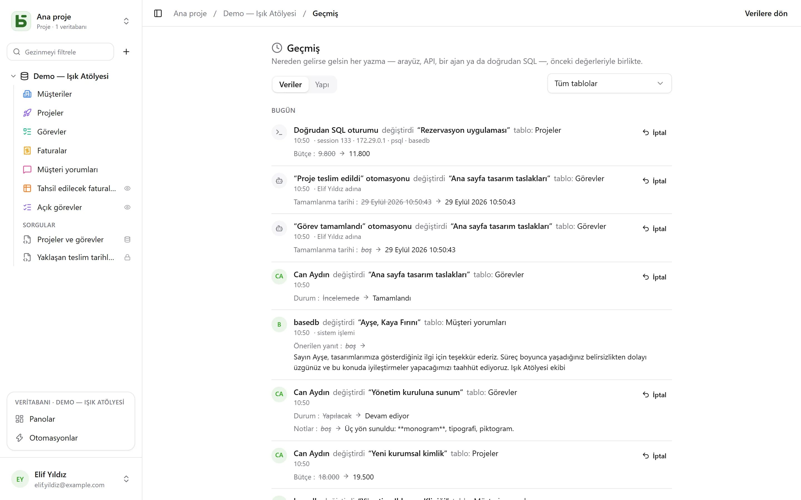

basedb, nereden gelirse gelsin **her yazmayı** geçmişe kaydeder: arayüz, API, bir MCP ajanı,
herkese açık bir form — hatta `psql`'de elle yazılmış bir SQL sorgusu bile.

## Nasıl kaydedilir

Uygulama tarafından değil, yazmanın kendi işlemi (transaction) içinde çalışan **PostgreSQL
tetikleyicileri** tarafından. Başarısız olan bir yazma hiçbir iz bırakmaz; başarılı olan bir
yazmanın izi eksik kalamaz. Revizyonlar ardından aylara göre bölümlenmiş, değiştirilemez
günlüklere aktarılır.

Kimlik, her işlemin başında ayarlanan oturum değişkenleriyle taşınır. Bunları taşımayan bir
yazma — doğrudan SQL — olduğu gibi, onu yapan oturumla (`psql`, adres, süreç) birlikte
kaydedilir: bu yüzden asla reddedilmez.

| Aktör | Nasıl görüntülenir |
|---|---|
| bir kişi | adı |
| bir program (API) ya da bir ajan (MCP) | token'ı oluşturan kişi, “… token'ı ile” |
| herkese açık bir form | “‘…’ formu · herkese açık yanıt” |
| bir otomasyon | “‘…’ otomasyonu · … adına”, otomasyondan sorumlu kişiyle |
| doğrudan SQL | “Doğrudan SQL oturumu” |

## Neler yapılabilir

- Bir satırın (satır ayrıntılarındaki “Geçmiş” sekmesi), bir tablonun ya da bir veritabanının
  (veritabanının **⋯** menüsündeki **Geçmiş**) geçmişini, tabloya göre filtreleyerek
  **okumak**.
- Bir değişikliği **geri almak**: önceki değerler alan alan yeniden uygulanır.
- Silinmiş bir satırı “sildi” kaydından **geri yüklemek**.
- **Yapı geçmişini** (“Yapı” sekmesi) izlemek: oluşturulan, değiştirilen, silinen tablolar ve
  alanlar.

## Geri al (Ctrl+Z)

Izgarada **Ctrl+Z** (Mac'te ⌘Z) son yazmanızı geri alır; **Ctrl+Shift+Z** ya da **Ctrl+Y**
onu yineler. Bir mesaj neyin geri alındığını doğrular — “Geri alındı: ‘Montant’ değişikliği” —
ve geri almayı iptal etmek için bir düğme sunar.

Bu şekilde bir hücre, taşınan bir kart ya da çubuk, oluşturulan ya da silinen bir satır, bir
yapıştırma — ve tek bir hareket sayılan bütün bir içe aktarma geri alınır. Sekme başına elli
harekete kadar.

Bu, ekranın geri sarılması değildir: sunucunun geçmişten yola çıkarak yaptığı ve kendisi de
geçmişe kaydedilen **yeni bir yazmadır**. O zamandan beri biri satırı değiştirdiyse, onun
çalışmasının üzerine yazmak yerine reddedilir — “Geri alınamıyor: ‘Statut’ o zamandan beri
değiştirildi”. Bu şekilde yalnızca kendi yazmalarınız, son yirmi dört saat içindekiler geri
alınır; yapı ise asla. Düzenlenmekte olan bir hücrede Ctrl+Z, metnin geri alma kısayolu olarak
kalır.

## İzinler

Geçmiş okuma izinlerini izler: sizden gizlenen bir alan, okuduğunuz revizyonlarda görünmez.
