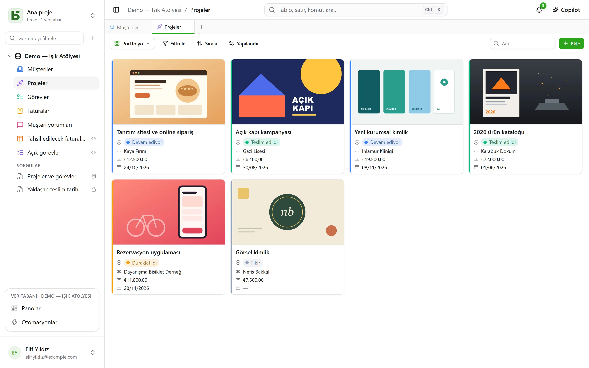
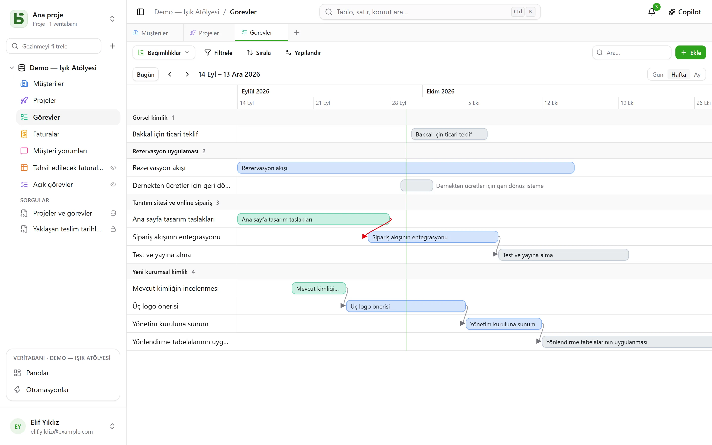
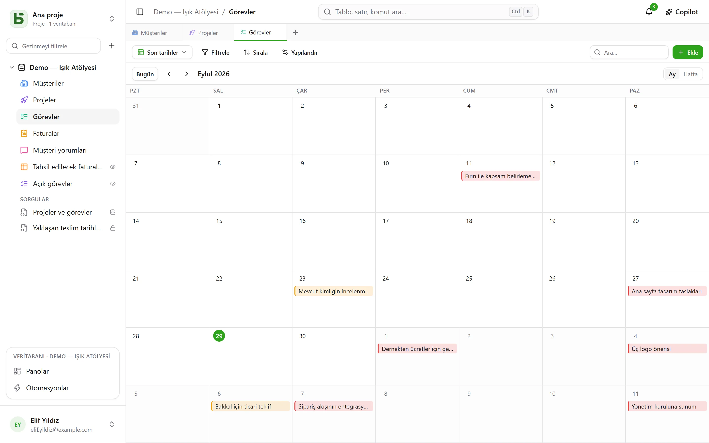
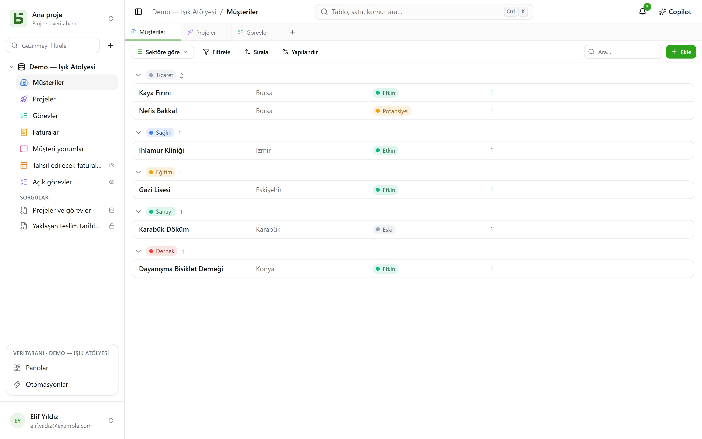

Bir tablo **on farklı şekilde** gösterilir. Bir görünüm hiçbir veriyi kopyalamaz ve tablonun
kendisinin verdiğinden fazla bir izin vermez.

:::note
Bu görünümler **tek bir** tabloyu göstermenin yollarıdır. Bir [SQL görünümü](/basedb/tr/fonctionnalites/requetes-et-vues-sql/)
başka bir şeydir: veritabanının tabloları üzerine SQL ile yazılmış, kenar çubuğunda onların
arasında yer alan gerçek bir PostgreSQL görünümü.
:::

| Görünüm | Ne gösterir | Neye ihtiyaç duyar |
|---|---|---|
| **Izgara** | filtrelenmiş, sıralanmış, gruplanmış satırlar, seçilmiş sütunlar | — |
| **Kanban** | sütunlar hâlinde kartlar | bir tekli seçim |
| **Takvim** | tarihlerine yerleştirilmiş satırlar, aylık ya da haftalık | bir tarih alanı |
| **Zaman çizelgesi** | iki tarih arasındaki çubuklar ve bağımlılıkları | bir başlangıç tarihi |
| **Galeri** | kapak görselli kartlar | — |
| **Liste** | kayıt başına bir satır, daraltılabilir gruplar hâlinde | — |
| **Harita** | her satır haritada kendi yerine yerleştirilir | bir adres, ya da bir enlem ve bir boylam |
| **Form** | bir satır oluşturmak için bir soru sayfası | — |
| **Anket** | aynı sorular, ekran başına bir soru | — |
| **Sınav** | puanlı sorular, ekran başına bir tane, sonunda skor | — |

## Görünüm seçici

“Filtrele”nin solundadır. “Tüm satırlar”, tablonun kimsenin kaydetmediği ve kimsenin
silemeyeceği ızgarasıdır; ardından veritabanını kuran kişinin seçtiği sırayla **ortak
görünümler**, sonra da **Görünümlerim** gelir. Altta, **Görünüm oluştur**, on türü iki aileye ayırır:
satırları gösterenler ve yanıt toplayanlar (form, anket, sınav).

- Bir **ortak görünümü** herkes görür. Onu oluşturmak, yapılandırmak, yeniden adlandırmak,
  yeniden sıralamak ya da silmek **Yönetim** düzeyini gerektirir. Görünüm **kilitlenebilir**:
  bir asma kilit bunu belirtir ve kilidi açılmadıkça kimse onu değiştiremez.
- Bir **kişisel görünümü** yalnızca siz görürsünüz ve yalnızca tabloyu okuyabilmeyi gerektirir.
  **Kişisel görünüm oluştur** ya da filtreleyip sıraladıktan sonra **Görünüm olarak kaydet**:
  herkes kendi okuma biçimlerini, başkaları için hiçbir şeyi değiştirmeden saklar. Bir ortak
  görünümde **Çoğalt**, görünümün kişisel bir kopyasını oluşturur.

## Araç çubuğu

Izgaranın üstünde, bu sırayla:

- **Filtrele** alan bazında koşulları birleştirir;
- **Sütunlar** neyin görüntüleneceğini seçer — sistem sütunları ayrıdır, “Sistem bilgileri”
  altındadır;
- **Grupla** satırları tek değerli bir alana — tekli seçim, ilişki, kişi, tarih, sayı, metin,
  onay kutusu… — göre daraltılabilir gruplara ayırır; her grubun, filtrenin tamamı üzerinden
  hesaplanan bir sayımı vardır;
- **Renkler** satırları bir tekli seçime ya da **kurallara** göre renklendirir — bir filtre ve
  bir renk, en fazla yirmi kural — kenar çizgisi, arka plan ya da ikisi birden;
- **Satır yüksekliği**: kısa, orta, yüksek, çok yüksek;
- sağdaki **Ara…**, siz yazarken tüm sütunlarda arar; Esc aramayı temizler. Kanban, takvim,
  zaman çizelgesi, galeri ve liste için de geçerlidir ve görünüme asla kaydedilmez.

Her sütunun altında, yalnızca sayfa üzerinden değil, filtredeki tüm satırlar üzerinden
hesaplanan bir **Özet** bulunur: dolu, boş, benzersiz değerler, toplam, ortalama, minimum,
maksimum, işaretli kutular.

## Kanban, takvim, zaman çizelgesi

- **Kanban** kartları bir tekli seçime göre düzenler; bir kartı sürüklemek satırı değiştirir,
  sütun başındaki “+” bu seçime sahip yeni bir satır oluşturur. Her kart bir başlık, bir kapak
  görseli, seçilen alanlar ve satırın değerlerine atıf yapan bir **açıklama** gösterir —
  “Teslimat `{{Date}}` tarihinde `{{Client}}` için planlandı” —; bu açıklama, görünümün
  ayarlarında **Alan yerleştir** düğmesiyle yazılır.
- **Takvim** her satırı, isteğe bağlı bir bitiş tarihiyle birlikte kendi tarihine yerleştirir;
  bir satırı bir günden diğerine sürüklemek onu kaydırır.
- **Zaman çizelgesi**, bir tekli seçime ya da bir ilişkiye göre gruplanmış, bir başlangıç ve
  bir bitiş tarihi arasında çubuklar çizer. **Bağlı olduğu** ayarıyla — tablonun kendisine giden
  bir ilişki — bir ok her görevi bağlı olduğu görevlere bağlar; zamanda geriye giden ok kırmızı
  olur.

## Galeri ve liste

- **Galeri** kartları gösterir: bir **kapak görseli** (kırpılmış ya da tam), bir boyut (küçük,
  orta, büyük kartlar), bir tekli seçime göre bir renk.
- **Liste**, bir tekli seçime, bir ilişkiye ya da bir kişiye göre **gruplanmış** olarak kayıt
  başına bir satır gösterir.

Kanban, galeri ve listede kartlar ve satırlar sürüklenerek **elle sıralanır** — 5.000'e kadar;
seçilen bir sıralama bu düzenin önüne geçer.

## Harita

**Harita**, her satırı şu bilgiye göre kendi yerine yerleştirir:

- bir **adres** — tercihen **Adres** biçimindeki kısa bir metin (bkz.
  [Tablolar ve alanlar](/basedb/tr/fonctionnalites/tables-et-champs/)): “12 rue des Lilas, Lyon”;
- ya da bir **enlem** ve bir **boylam**, iki sayı alanı, oldukları gibi yerleştirilir.

Bir iğne bir tekli seçimin **rengini** alır, üzerine gelindiğinde satırın **başlığını**
gösterir ve tıklandığında satır ayrıntılarını açar. Harita, görünümün filtresini ve sıralamasını
izler, 2.000 satıra kadar.

Bir adres, kurulumun coğrafi kodlama servisi tarafından — varsayılan olarak OpenStreetMap'inki —
**bir kez ve kalıcı olarak konumlandırılır**, servisin dayattığı hızda: yeni bir haritada iğneler
yanıtlar geldikçe belirir, saniyede bir tane kadar, ardından sonraki seferlerde hemen. Bir rozet,
yerleştirilen satırları, konumlandırılmayı bekleyen adresleri ve konumlandırılamayanları sayar:
bulunamayan bir adres belirtilmesi gereken bir adrestir (şehir, posta kodu), sessizce bir kenara
atılmaz.

:::note[Sunucunuzdan çıkan şey]
Adreslerin metni coğrafi kodlama servisine gider ve her okuyucunun tarayıcısı harita altlığını
karo sunucusundan yükler. Kurulumu işleten kişi başka servisler seçebilir, ya da hiçbirini
istemeyebilir: bkz.
[Ortam değişkenleri](/basedb/tr/hebergement/variables/#haritalar-ve-adresler).
:::

## Form ve anket

Soruları işaretler ve sıralarsınız; her sorunun bir başlığı, bir yardım metni, bir örnek yanıtı
vardır ve soru zorunlu yapılabilir. Formun bir başlığı, bir tanıtım metni, bir düğme etiketi ve bir
teşekkür mesajı vardır. Form basedb içinde doldurulur ya da
[bir bağlantıyla paylaşılır](/basedb/tr/fonctionnalites/formulaires-partages/).

Başlamak için hiçbir şeyi ayarlamaya gerek yoktur: yeni bir form, bir kişinin ne yanıtladığını
sorar — ekibin daha sonra doldurduğu durumu, atanan kişiyi ya da ilişkileri değil, zorunlu
olmadıkça —, tablosunun rengini ve açık bir temayı taşır ve her boş alan uygun bir örnek gösterir.
Geri kalan her şey istediğiniz zaman değiştirilir:

- **Görünüş**: sekiz tema — Açık, Yumuşak, Şafak, Okyanus, Orman, Gece, Kağıt, Minimal —, bir
  vurgu rengi, bir yazı tipi, sola ya da ortaya hizalama;
- **Bugünün tarihiyle önceden doldur**: bir tarih sorusu bugünün tarihiyle — tarih ve saat
  sorusunda saatiyle birlikte — dolu gelir; kişi bunu korur ya da değiştirir;
- **Koşullu sor…**: bir soru, yalnızca önceki bir yanıt bunu gerektiriyorsa sorulur
  (“Duygu Negatif”, “Puan en fazla 2”). Gizli bir soru ne zorunludur ne de gönderilir;
- **Daha fazla seçenek**: karşılama ve gönderme düğmeleri, numaralar, ilerleme çubuğu, bir sonrakine
  otomatik geçiş, mesaj ve bir bitiş düğmesi (“Siteye dön”), konfetiler.

**Anket**, ekranın tamamını kaplar: ne kadar süreceğini söyleyen bir karşılama, ardından kayarak
gelen, birer birer sorular. Her şey klavyeyle de yapılabilir: devam etmek için **Enter**, bir seçim
için **A**, **B**, **C**… harfleri, evet ya da hayır için **E** ya da **H**, bir puan için
rakamlar — tekli bir seçim kendiliğinden bir sonraki soruya geçer. Gönderim kutlanır: çizilen bir
onay işareti ve formun renklerinde konfetiler.

## Sınav

Bir sınav, puan sayan bir ankettir. Her sorunun altında, **doğru cevabı** ve onun kaç puan
kazandırdığı belirtilir — hiçbir şey belirtilmezse **1 puan**, 100’e kadar:

| Soru | Doğru cevap |
|---|---|
| tekli seçim | bir seçenek |
| çoklu seçim | işaretlenmesi gereken seçenekler, hepsi ve yalnızca onlar |
| onay kutusu | evet ya da hayır |
| sayı, derecelendirme | bir sayı |
| tarih | bir gün |
| kısa metin, e-posta, URL | `;` ile ayrılmış bir ya da birden çok kabul edilen yanıt — büyük/küçük harf ve aksan gözetilmeden |

Doğru cevabı olmayan bir soru — bir ad, bir yorum — sorulur ama puanlanmaz. Sınavı oluşturmak
için en az bir puanlı soru gerekir.

**Puanlama** bölümü geri kalanını ayarlar:

- **Düzeltme**: **her sorudan sonra** — yanıt hemen kontrol edilir, doğruysa yeşil, yanlışsa
  doğru cevapla birlikte kırmızı, ve skor ekranın üstünde büyür —, **sonunda** — önce skor,
  ardından düzeltme —, ya da **hiçbir zaman** — yalnızca skor, doğru cevaplar gizli kalır;
- **Geçme eşiği**: puanların bir yüzdesi; bitiş ekranı o zaman “Başarılı!” ya da “Bu sefer
  olmadı…” der;
- **Skorun kaydedileceği yer**: tablonun bir sayı alanı, her yanıtın skorunu alır. Izgarayı buna
  göre sıralayın: işte sıralama. “Score”, “Points” ya da “Note” adlı bir alan otomatik olarak
  seçilir.

Bitiş ekranı skoru dolan bir halkada gösterir, ardından yüzdeyi, sonra da, “hiçbir zaman”
seçilmediyse, verilen yanıtla ve doğru cevapla birlikte her puanlı soruyu. Önceki bir yanıtın
gizlediği bir soru toplama dahil edilmez.

:::note
Uygulamada, görünümü okuyabilen kişi doğru cevapları da okuyabilir. [Paylaşılan bir
bağlantıyla](/basedb/tr/fonctionnalites/formulaires-partages/#paylaşılan-sınav), bunlar
sunucudan asla çıkmaz: kontrol eden ve sayan odur.
:::

## Bir görünümü paylaşma

Bir veri görünümü — ızgara, kanban, takvim, zaman çizelgesi, galeri, liste — bir bağlantıyla
**salt okunur olarak paylaşılır**, başka bir siteye yerleştirilir ve bir takvim, bir ajanda
akışına dönüşür. Bkz. [Paylaşılan görünümler](/basedb/tr/fonctionnalites/vues-partagees/).

## Okuyanın görmedikleri

Bir görünüm **okuyucusu için yeniden yansıtılır**: ondan gizlenen bir alan sütunlardan,
kartlardan ve sorulardan kaybolur. Filtresi gizli bir alana atıf yapan bir görünüm hiç
gösterilmez: filtresi olmadan gösterilseydi, gösterilmek için yapıldığından fazlasını
gösterirdi.
