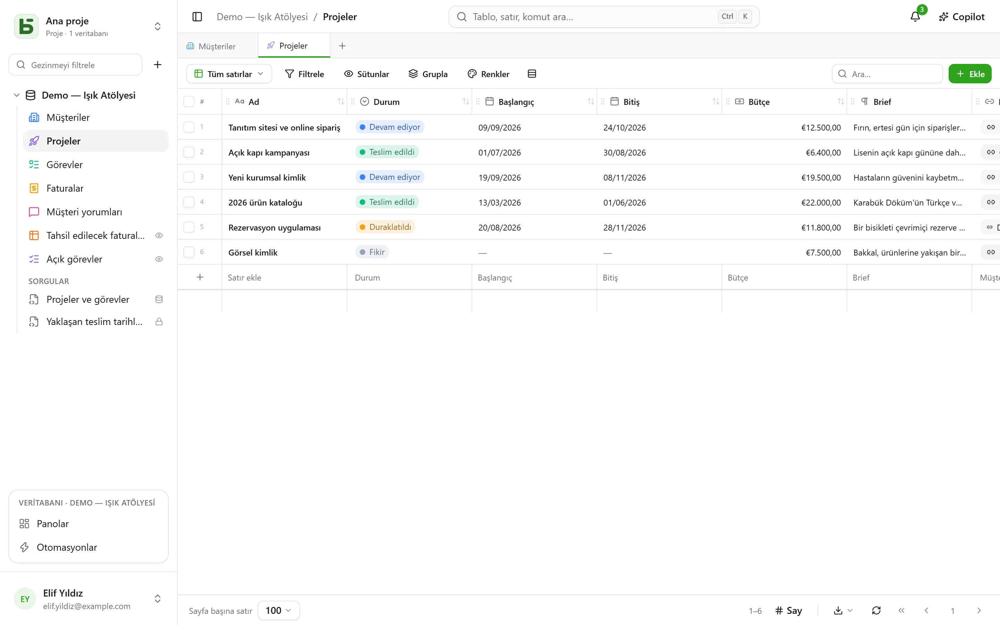

**basedb**, işbirlikçi elektronik tablolar anlayışında, kendi sunucunuzda barındırdığınız
ortak bir veritabanıdır — geri kalan her şeyi belirleyen bir farkla: **verileriniz, tipli ve
açıkça adlandırılmış gerçek PostgreSQL tablolarında yaşar**.

## Basit bir vaat

Genel amaçlı bir model yok, her şeyin içine atıldığı bir `JSONB` yok, `field_1837` yok:

| basedb'de | PostgreSQL'de |
|---|---|
| “Ventes” adlı bir veritabanı | bir `b_t4z56fq_ventes` şeması |
| “Opportunités” adlı bir tablo | bir `opportunites` tablosu |
| “Échéance” adlı bir alan (Tarih) | bir `echeance date` sütunu |
| “Statut” adlı bir tekli seçim | bir `text` sütunu ve onun `CHECK` kısıtlaması |
| “Client” adlı bir ilişki | bir `clients_id uuid` sütunu ve onun `FOREIGN KEY` kısıtlaması |

Böylece `psql`'i, bir BI aracını ya da bir Python betiğini açıp verilerinizi üründen geçmeden
okuyabilirsiniz — hatta onlara yazabilirsiniz: kısıtlamalar geçerliliğini korur ve geçmiş bu
yazmayı kaydeder.

## Kimler için?

- Bir geliştirme beklemeden ızgara, görünüm ve form isteyen **iş ekipleri**.
- Verilerinin kapalı bir biçime hapsolmasını kabul etmeyen ve alışkın oldukları araçları
  bağlamak isteyen **teknik ekipler**.
- Burada bir MCP sunucusu, açık izinler ve bir kişinin onayına sunulan öneriler bulan
  **yapay zeka ajanları**.

## Burada neler bulacaksınız

- Tipli [tablolar ve alanlar](/basedb/tr/fonctionnalites/tables-et-champs/), gerçek yabancı
  anahtar olan — ya da çoklu olan — ilişkiler, PostgreSQL tarafından hesaplanan formüller,
  ilişkiler üzerinden aramalar ve toplamalar.
- On [görünüm](/basedb/tr/fonctionnalites/vues/): ızgara, kanban, takvim, zaman çizelgesi,
  galeri, liste, harita, form, anket, sınav — ortak ya da kişisel.
- Bir bağlantıyla paylaşılan [formlar](/basedb/tr/fonctionnalites/formulaires-partages/) ve
  [görünümler](/basedb/tr/fonctionnalites/vues-partagees/), bir ajandadan abone olunabilen
  takvimler.
- [İşbirliği](/basedb/tr/fonctionnalites/collaboration/): yorumlar ve bahsetmeler,
  bildirimler, gerçek zamanlı güncellemeler.
- [Otomasyonlar](/basedb/tr/fonctionnalites/automatisations/),
  [panolar](/basedb/tr/fonctionnalites/tableaux-de-bord/) ve fareyle ya da SQL ile oluşturulan soruları.
- Herkesin kendi izinleriyle kullandığı [herkes için SQL](/basedb/tr/fonctionnalites/requetes-et-vues-sql/):
  tabloların altında kayıtlı sorgular ve onların arasında yer alan gerçek PostgreSQL görünümleri.
- Bir galeriden seçilen ya da yapay zekadan istenen
  [veritabanı şablonları](/basedb/tr/fonctionnalites/modeles/).
- Karşılaştırılan ve birbirine taşınan [ortamlar](/basedb/tr/fonctionnalites/environnements/)
  — canlı, test.
- Doğrudan SQL dahil her yazmanın [geçmişi](/basedb/tr/fonctionnalites/historique/) ve geri
  almak için Ctrl+Z.
- Grup bazında, alan düzeyine kadar inen [izinler](/basedb/tr/fonctionnalites/droits/).
- Bir [REST API](/basedb/tr/integrations/api-rest/), bir [MCP sunucusu](/basedb/tr/integrations/mcp/),
  [webhook'lar](/basedb/tr/integrations/webhooks/), Slack ve
  [senkronize tablolar](/basedb/tr/integrations/synchronisation/).
- İsteğe bağlı [yapay zeka](/basedb/tr/fonctionnalites/ia/): bir model tarafından hesaplanan
  alanlar, Copilot.

## Projenin durumu

basedb, yapay zeka odaklı bir yazılım stüdyosu olan [Eodia](https://eodia.com/fr/) tarafından
geliştirilen özgür bir yazılımdır (AGPL-3.0) ve aktif olarak geliştirilmektedir. Çekirdek, API,
MCP sunucusu ve arayüz çalışır durumdadır ve binden fazla testle güvence altındadır;
[yol haritası](/basedb/tr/feuille-de-route/) henüz gelecek olanları anlatır. Yirmi kadar
bölümden oluşan [mimari belgesi](https://github.com/eodia/basedb/tree/main/docs/architecture)
her kararı kayıt altına alır.

:::tip[Deneyin]
Depo klonlandıktan sonra tek bir komut yeter: `docker compose up -d`. Bkz.
[kurulum](/basedb/tr/guides/installation/).
:::
