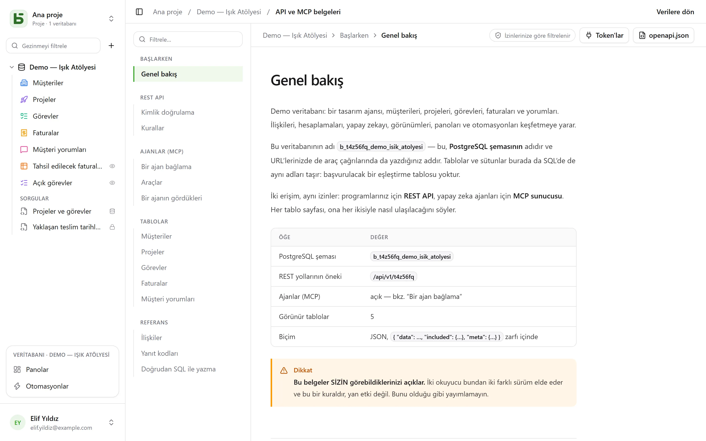

REST API, arayüzün kullandığı API ile aynıdır: **özel bir yol yoktur**. URL'leri fiziksel
adları taşır — SQL'de de okuduğunuz adları.

```text
/api/v1/<tenant>/data/<base>/<table>
/api/v1/t4z56fq/data/b_t4z56fq_ventes/opportunites
```

## Bir token

Arayüzde, veritabanının **⋯** menüsü → **API ve ajanlar** → **API ve MCP token'ları…**: veritabanı
ya da projesi üzerinde **Yönetim** düzeyine sahip olan kişi, şifresini doğruladıktan sonra
burada bu veritabanıyla sınırlı — tüm ortamlarıyla ya da yalnızca biriyle —, varsayılan olarak
salt okunur bir **entegrasyon token'ı** oluşturur — bir kimlik sağlayıcısıyla giriş yapan şifresiz
bir hesap bunu henüz yapamaz. Token yalnızca bir kez gösterilir; onu bir ortam değişkenine koyun.

Bir token okur; yazma yetkisiyle oluşturulduysa oluşturur ve değiştirir, bunun için
oluşturulduysa da **siler** — “Okuma, yazma ve silme” hakları, kademeli (cascade) bir ilişkinin
başka satırlarla birlikte götüreceği bir satır hariç. Onu oluşturan kişiden asla daha fazla izne
sahip olmaz.

```bash
export BASEDB_TOKEN=bdb_…
curl "http://localhost:3000/api/v1/t4z56fq/data/b_t4z56fq_ventes/opportunites?limit=20" \
  -H "Authorization: Bearer $BASEDB_TOKEN"
```

## Ortamı seçme

Birden çok [ortamı](/basedb/tr/fonctionnalites/environnements/) — canlı, test… — olan bir
veritabanı, tüm veritabanı için oluşturulmuş bir token açısından **tek** bir veritabanı olarak
kalır. Yol, veritabanını canlı ortamının adıyla adlandırır ve `X-Basedb-Environment` başlığı
ortamı seçer:

```bash
curl "http://localhost:3000/api/v1/t4z56fq/data/b_t4z56fq_ventes/opportunites" \
  -H "Authorization: Bearer $BASEDB_TOKEN" \
  -H "X-Basedb-Environment: recette"
```

- Başlık yoksa, yolun adlandırdığı ortam kullanılır: `b_t4z56fq_ventes` canlı,
  `b_t4z56fq_ventes_recette` test ortamıdır — iki yazım da geçerli kalır.
- `?environment=recette`, başlık göndermeyen bir istemci için aynı işi görür.
- Bir ortam, rozetinin adıyla — büyük/küçük harf ve aksan ayrımı yapılmadan — ya da
  `production` ile adlandırılır. Veritabanında bulunmayan bir ortam, var olmayan her kaynak gibi
  `404` yanıtı verir.
- `GET /api/v1/<tenant>/meta/bases`, her ortamı `environment` bloğuyla (`label`, `production`)
  listeler; başlıkla yalnızca o ortamı listeler.

Oluşturulurken tek bir ortamla sınırlanmış bir token başka hiçbirini açmaz: başlık bunu
değiştirmez. İzinleri her zaman, ortam ortam, onu oluşturan kişinin izinleriyle kesiştirilir.

## Okuma

| Parametre | Rol |
|---|---|
| `filter` | okunabilir bir ifade: `statut eq "gagne" and montant gte 10000` |
| `sort` | `-montant,nom` |
| `fields` | döndürülecek sütunlar |
| `limit`, `after` | şifreli imleçle sayfalama: bir sayfanın `meta.next_cursor`'ı, `after` olarak geçirildiğinde bir sonrakini verir (`meta.has_next_page`) |
| `links=display` | ilişkiler, görüntüleme değerleriyle birlikte |
| `count=exact` | toplam, en fazla 100.000 |
| `variables=raw` | uzun metinler, [satırın değerleriyle](/basedb/tr/fonctionnalites/tables-et-champs/#zengin-metin-ve-değişkenler) değil, `{{colonne}}` dahil yazıldıkları gibi |

Operatörler: `eq`, `ne`, `eq_ci`, `contains`, `starts_with`, `ends_with`, `in`, `is_null`,
`gt`, `gte`, `lt`, `lte`, `between`; `and`, `or`, `not` ve parantezlerle birleştirilir. Bir
filtre bir ilişkiyi aşabilir: `clients_id.ville eq "Lyon"`.

## Yazma

```bash
curl -X POST "http://localhost:3000/api/v1/t4z56fq/data/b_t4z56fq_ventes/opportunites" \
  -H "Authorization: Bearer $BASEDB_TOKEN" -H "content-type: application/json" \
  -d '{"values": {"nom": "Audit RGPD", "statut": "nouveau", "montant": 12000}}'
```

`PATCH …/<table>/<_id>` aynı `{"values": {…}}` gövdesiyle bir satırı değiştirir. Hataların tek
bir biçimi vardır: `{ "code": "…", "details": {…}, "request_id": "…" }`; her neden için kararlı
bir kod.

Her yazma `x-basedb-transaction` başlığını döndürür: bu değeri
`POST /api/v1/<tenant>/history/undo` adresine (`{"transaction": "…"}`) göndermek, arayüzdeki
Ctrl+Z gibi yazmayı geri alır — satır o zamandan beri değiştirildiyse reddedilir.

## Satırların ötesinde

Aynı token ile:

| Yol | Rol |
|---|---|
| `GET …/data/<base>/<table>/aggregate` | bir filtrenin tüm satırları üzerinde özetler: `aggregates=montant:sum,nom:filled`, `group=statut` |
| `GET …/data/<base>/<table>/<_id>/comments`, `POST` | bir satırın yorumlarını okumak ve yazmak |
| `POST /api/v1/<tenant>/automations/<id>/run` | bir düğmeyle tetiklenen bir otomasyonu bir satır üzerinde başlatmak (`{"record": "…"}`) |
| `GET /api/v1/<tenant>/meta/bases/<base>/dashboards` | bir veritabanının panoları |
| `GET /api/v1/<tenant>/meta/users` | bir Kişi alanı için çalışma alanının üyeleri |
| `GET /api/v1/<tenant>/meta/templates` | galerideki veritabanı şablonları |
| `GET /api/v1/<tenant>/events?base=<base>&table=<table>` | bir tabloyu gerçek zamanlı takip etmek: yukarıdaki yollarla yeniden okunan sinyaller (bkz. [Webhook'lar](/basedb/tr/integrations/webhooks/#webhook-olmadan-bir-tabloyu-takip-etmek)) |

[Paylaşılan görünümler](/basedb/tr/fonctionnalites/vues-partagees/) hesap olmadan okunur:
JSON olarak `GET /api/v1/views/<jeton>` ve `…/rows`, iCalendar olarak `…/calendar.ics`.

İnşa etmek — bir otomasyon, bir pano, bir entegrasyon oluşturmak — arayüzde açılmış bir
oturuma ayrılmıştır: bir token satırları okur ve yazar, veritabanını değiştirmez.

## Renkler ve simgeler

Bir tablonun ve bir seçim listesinin her seçeneğinin bir rengi (`color`, `#rrggbb`) ve bir simgesi
(`icon`, arayüzün çizdiği bir [Lucide](https://lucide.dev/icons/) simgesinin adı: `truck`,
`circle-check`, `flame`…) vardır. `GET …/meta/bases/<base>` bunları veritabanı, tabloları ve
alanlarının seçenekleri için döndürür.

Bunları seçmek için, yapıyı değiştirebilen bir kişinin erişim token'ıyla
(`POST /auth/session/access`) — bir entegrasyon token'ı veritabanını değiştirmez:

| Yol | Gövde |
|---|---|
| `POST …/admin/bases/<base>/tables` | `{"label": "Tickets", "color": "#dc2626", "icon": "flame", "fields": […]}` |
| `PATCH …/admin/bases/<base>/tables/<table>` | `{"color": "#2563eb", "icon": "inbox"}` — `color`, `icon`, `image` anahtarları birlikte gider: birini yazmak üçünü de değiştirir |
| `POST …/admin/bases/<base>/tables/<table>/fields` | `{"label": "Priorité", "kind": "select", "options": [{"value": "haute", "color": "#dc2626", "icon": "flame"}, …]}` |
| `PUT …/admin/bases/<base>/tables/<table>/fields/<champ>/options` | seçeneklerin tüm listesi, sırasıyla, her biri rengi ve simgesiyle |

Bir ajan, bu değişiklikleri **önerdiği** [MCP sunucusu](/basedb/tr/integrations/mcp/#renkler-ve-simgeler)
üzerinden geçer. Bir alanın seçilecek bir simgesi yoktur: arayüz, türünün simgesini çizer.

## Bir şablondan veritabanı oluşturmak

Kurulan bir uygulama veritabanını **tek bir çağrıyla** oluşturur: sunucu şablonu uygular —
tablolar, alanlar, ilişkiler, örnek satırlar, görünümler, panolar, otomasyonlar — ve bir adım
başarısız olursa arkasında hiçbir veritabanı bırakmaz.

```bash
curl -X POST "http://localhost:3000/api/v1/t4z56fq/admin/bases" \
  -H "Authorization: Bearer $ACCES" -H "content-type: application/json" \
  -d '{"template": "crm", "label": "Ventes", "rows": false}'
```

`template`, galerideki bir şablonun anahtarıdır ya da
[şablon biçimindeki](/basedb/tr/fonctionnalites/modeles/) eksiksiz bir şablondur.
`Accept: application/x-ndjson` başlığıyla yanıt satır satır gelir: her adım için bir
`{"step": …}` satırı, ardından oluşturulan veritabanı. Bu çağrı, veritabanı oluşturabilen bir
kişinin erişim token'ını gerektirir (`POST /auth/session/access`, giriş yaptıktan sonra): bir
entegrasyon token'ı yalnızca var olan bir veritabanını açar.

## Bir token'ı doğrulamak

basedb'nin token'ları basedb dışında doğrulanamaz. Bir token alan uygulama — örneğin, basedb'den
kişinin token'ıyla açılan bir araç — kendi entegrasyon token'ıyla onun ne değerde olduğunu sorar
(introspection, RFC 7662):

```bash
curl -X POST "http://localhost:3000/auth/introspect" \
  -H "Authorization: Bearer $BASEDB_TOKEN" \
  --data-urlencode "token=$JETON_RECU"
```

```json
{ "active": true, "token_type": "access_token",
  "sub": "0195a…", "email": "claire@example.com", "name": "Claire Martin",
  "tenant": "t4z56fq", "groups": ["Commerciaux"], "exp": 1790000000 }
```

Değeri olmayan her token — bilinmeyen, süresi dolmuş, iptal edilmiş, oturumu kapanmış, başka bir
çalışma alanına ait — nedenini söylemeden `{"active": false}` yanıtını verir. Yanıt canlı olarak
okunur: bir çıkış hemen görülür. Bir entegrasyon token'ı için yanıt, açtığı veritabanını
(`base`, canlı ortamı), tüm ortamlarını mı (`environments`: `all`) yoksa yalnızca birini mi
(`one`) açtığını, erişimini (`read`, `write` ya da `delete`) ve yüzeylerini de söyler.

## Oluşturulan belgeler

Her veritabanının bir **API ve MCP belgeleri** sayfası vardır: her tablo için uç noktaları,
sütunları, cURL ve JavaScript örnekleri. Sayfa **izinlerinize göre filtrelenir** — iki okuyucu
iki farklı sürüm görür —, **ekranınızın dilinde** yazılır ve OpenAPI 3.1 olarak da sunulur
(`/api/v1/<tenant>/meta/bases/<base>/openapi.json`); bu belge Bearer token'ını ve
`X-Basedb-Environment` başlığını tanımlar. Adlar, yollar ve hata kodları tüm dillerde aynı
kalır.


