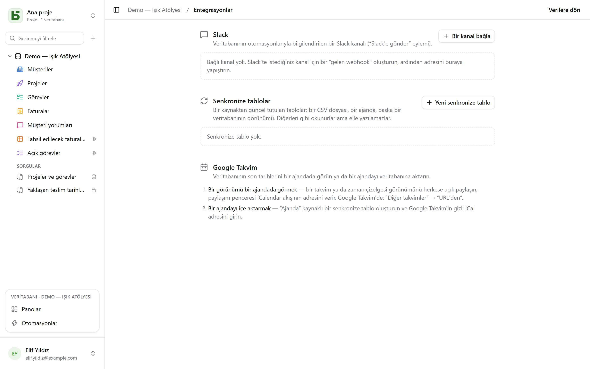

Bir veritabanının **Entegrasyonlar** ekranı, sol alttaki profil menüsünden açılır. **Yönetim**
düzeyini gerektirir ve veritabanını diğer araçlarınıza bağlayan her şeyi bir araya getirir.

## Slack

**Bir kanal bağla**: Slack'te istediğiniz kanal için bir *gelen webhook* oluşturun, ardından
adresini yapıştırın (`https://hooks.slack.com/…`, kabul edilen tek kaynak). **Test et** bir
deneme mesajı gönderir. Adres kaydedilir kaydedilmez şifrelenir ve bir daha asla gösterilmez.

Bağlı kanal daha sonra [otomasyonların](/basedb/tr/fonctionnalites/automatisations/) bir eylemi
olur: **Slack'e gönder**, satıra atıf yapan bir mesajla — “{{Auteur}} tarafından yeni olumsuz
değerlendirme: {{Avis}}”.

## Ajandalar

İki yön, iki yol:

- **Bir görünümü bir ajandada görmek**: bir takvim ya da zaman çizelgesi görünümünü herkese açık
  olarak paylaşın; paylaşım iletişim kutusu, Google Takvim (“Diğer takvimler” → “URL'den”),
  Outlook ya da Apple Takvim'den abone olunabilen bir **iCalendar akışının** adresini verir.
  Bkz. [Paylaşılan görünümler](/basedb/tr/fonctionnalites/vues-partagees/#ajandanızda-bir-takvim).
- **Bir ajandayı içe aktarmak**: ajandanın gizli iCal adresiyle, kaynağı “Ajanda” olan bir
  senkronize tablo oluşturun.

## Senkronize tablolar

Senkronize bir tablo **bir kaynaktan güncel tutulur**: diğer tablolar gibi okunur, filtrelenir
ve görünümlerde gösterilir, ama elle yazılamaz — bir “Senkronize” rozeti bunu hatırlatır ve API
her yazmayı reddeder (`TABLE_SYNCED`).

| Kaynak | Tablo neye dönüşür |
|---|---|
| **Çevrimiçi CSV dosyası** | dosyanın her sütunu için bir sütun, içeriğine göre tiplendirilmiş: sayı, tarih ya da metin |
| **Ajanda** (Google Takvim, iCalendar) | satır başına bir etkinlik: başlık, başlangıç, bitiş, yer, açıklama |
| **Bir basedb'nin paylaşılan görünümü** | bu kurulumda ya da başka bir kurulumda, [paylaşılan bir görünümün](/basedb/tr/fonctionnalites/vues-partagees/#diğer-veritabanları-için-bir-kaynak) satırları |

**Yeni senkronize tablo** kaynağı ve aralığı seçer — 15 dakikada birden günde bire kadar;
**Senkronize et** tabloyu hemen yeniden okur. Her geçiş, bir **Senkronizasyon anahtarı**
alanını esas alarak, tablonun kaynağa benzemesi için gerekeni oluşturur, değiştirir ve siler.
Tüm bu yazmalar geçmişten geçer.

**Durdur**, senkronizasyonu sonlandırır ve tabloyu sıradan bir tabloya dönüştürür: satırları
kalır ve yeniden elle yazılabilir.

## Sınırlar

- Bir kaynak 5 MB, 10.000 satır ve 10 saniye sınırı içinde okunur.
- Başarısız olan bir kaynak hiçbir şeyi silmez: tablo bir sonraki geçişe kadar satırlarını
  korur.
- Tablo oluşturulduktan sonra kaynakta beliren bir sütun eklenmez.
- Slack, henüz bir Slack uygulamasıyla değil, gelen webhook ile bağlanır.
