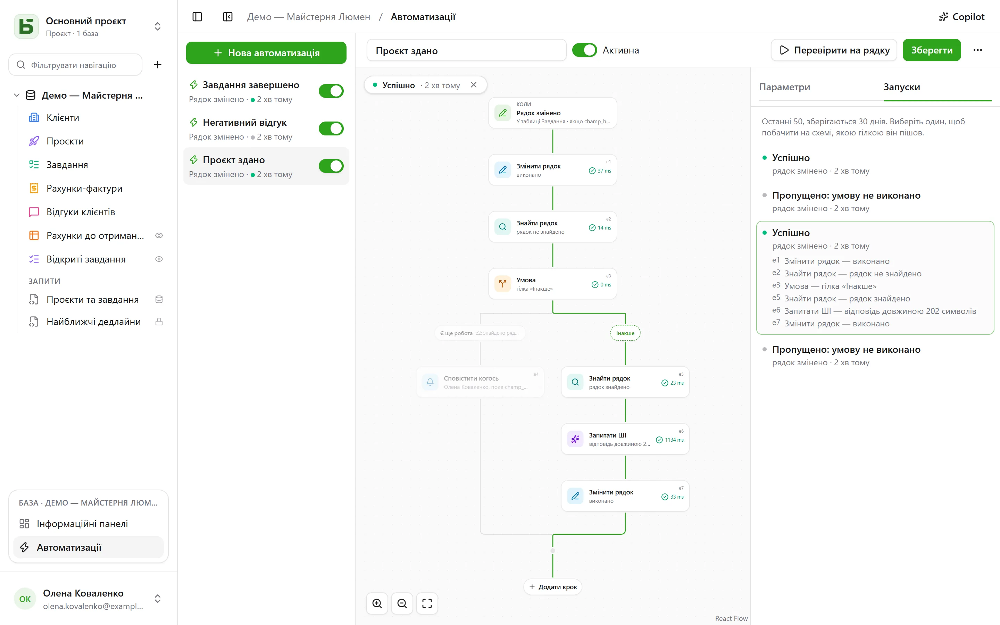

Автоматизація визначає **коли**, **якщо** і **тоді**: коли завдання переходить у «Готово» —
записати час; коли надходить негативний відгук — сповістити відповідальну особу й написати в
Slack; щопонеділка о 9:00 — створити рядок для зустрічі команди. А коли однієї дії замало,
вона виконує **потік**: знайти рядок, піти тією чи іншою гілкою залежно від того, що в ньому, і
використати на одному кроці те, що знайшов або записав попередній крок.

Їх відкривають через **Автоматизації** в блоці відкритої бази внизу бічної панелі, і вони
потребують рівня **Керування**.



## Потік

Потік малюється згори донизу: тригер, а потім кожен крок. **+** на лінії додає крок у цьому
місці; картка відкриває свої налаштування праворуч. Проста автоматизація — тригер і одна дія —
вміщується у дві картки й налаштовується, як і раніше.

## Коли

| Тригер | Налаштування |
|---|---|
| **Рядок створено** | таблиця |
| **Рядок змінено** | таблиця і, за потреби, лише ті поля, за якими треба стежити |
| **За розкладом** | щогодини, щодня чи щотижня, у вибраний час і часовому поясі |
| **Натиснуто кнопку** | [поле «Кнопка»](/basedb/uk/fonctionnalites/tables-et-champs/#кнопка) таблиці |

Тригер на рядках бачить **усі** записи: з інтерфейсу, API, від агента, з опублікованої форми і
навіть із прямого SQL — автоматизації запускаються з історії, яка фіксує їх усі.

## Лише якщо

Необов’язкова умова [мовою фільтрів](/basedb/uk/integrations/api-rest/#читання) —
`statut eq "fait"`, `montant gte 10000 and payee eq false`, — яка перевіряється для рядка **в
момент дії**. Запуск, умова якого не виконується, «пропускається», і про це повідомляється.

## Тоді

До тридцяти кроків по черзі; перший крок, що завершився помилкою, зупиняє наступні.

| Крок | Що він робить |
|---|---|
| **Змінити рядок** | записує значення в рядок, який запустив автоматизацію, — або в той, що його знайшов чи створив один із кроків |
| **Створити рядок** | у цій таблиці або в іншій таблиці бази |
| **Знайти рядок** | перший рядок таблиці, що відповідає фільтру, щоб наступні кроки посилалися на нього чи змінювали його |
| **Сповістити когось** | [сповіщення](/basedb/uk/fonctionnalites/collaboration/#сповіщення) вибраним людям або людині з поля «Особа» |
| **Надіслати електронний лист** | людям з команди, особі з поля «Особа», на адресу з поля «Електронна пошта» — клієнту, постачальнику — або на вписані адреси; тема та текст цитують рядок і попередні кроки |
| **Викликати вебхук** | `POST` через HTTPS на адресу на ваш вибір; на його відповідь потім можна посилатися |
| **Надіслати в Slack** | повідомлення в [підключений](/basedb/uk/integrations/synchronisation/#slack) канал |
| **Запитати ШІ** | відповідь [постачальника ШІ](/basedb/uk/fonctionnalites/ia/) на інструкцію, яка посилається на рядок і попередні кроки, — написати, підсумувати, класифікувати, — прочитана як текст, число, так чи ні, дата або варіант зі списку |
| **Умова** | кілька гілок: вибирається перша, умова якої виконується, або «Інакше», якщо не виконується жодна; потім гілки знову сходяться |

Пошук, який нічого не знайшов, не зупиняє потік: кроки, що мали змінити його рядок,
пропускаються. Щоб у такому разі зробити щось інше, це перевіряє умова — гілка з порожнім
фільтром вибирається, щойно пошук щось знайшов.

## Запитати ШІ

Як і [поле ШІ](/basedb/uk/fonctionnalites/ia/#опція-ші-для-поля), крок надсилає постачальнику
свою інструкцію, де кожне посилання замінено його значенням:

```text
Cet avis de {{auteur}} demande-t-il une action de notre part ? {{avis}}
```

Ви вибираєте **очікувану відповідь** — вільний чи короткий текст, число, так чи ні, дату,
вебадресу або варіант зі списку, який можна взяти з поля вибору. Модель про це попереджають, і
відповідь, яка його не містить, призводить до помилки кроку. Наступні кроки посилаються на неї
через `{{e1.reponse}}`: у назві створеного завдання, у повідомленні чи в полі вибору, де вона
потрапляє у варіант із тим самим підписом.

Те, на що посилається інструкція, надсилається постачальнику: крок потребує вашої **згоди**,
яку треба надати знову, коли інструкція змінюється. Кожен виклик журналюється й враховується
разом із полями ШІ в `BASEDB_AI_FIELD_QUOTA` (типово 300 на годину). ШІ нічого не робить
самостійно: записують чи сповіщають кроки, розташовані після нього.

## Посилання на значення

Значення, повідомлення й фільтри можуть посилатися на те, що було раніше, через кнопку **{ }**
поруч із кожним текстом:

- `{{Titre}}`, `{{_id}}`: рядок, який запустив автоматизацію;
- `{{e2.titre}}`, `{{e2._id}}`: рядок, знайдений, створений чи змінений кроком `e2`, — кожен
  крок має свій ідентифікатор на картці;
- `{{e3.statut}}`, `{{e3.reponse.numero}}`: що відповів вебхук `e3`;
- `{{e4.reponse}}`: відповідь кроку ШІ `e4`;
- `{{_maintenant}}`: момент запуску.

Значення, що складається з одного посилання, передає саме значення: зв’язок, особу, варіант
вибору — саме так створений рядок пов’язується з тим, який знайшов пошук. У фільтрі посилання
завжди є значенням для порівняння, а не частиною мови фільтрів.

Крок може посилатися лише на те, що гарантовано відбулося до нього: на те, що знайшла одна з
гілок, після умови посилатися вже не можна. Редактор повідомляє про це на картці ще до
збереження.

## Copilot

**Copilot** у заголовку відкриває праворуч розмову природною мовою про автоматизації бази:
«коли завдання переходить на перевірку, сповісти призначену людину», «додай підсумок від ШІ в
нотатки», «чому останній запуск завершився помилкою?». Він відповідає і **пропонує** цілу
автоматизацію — ту, що у вас на екрані, змінену, або нову, — зі списком змін.

Copilot нічого не зберігає: **Накласти на потік** показує пропозицію в редакторі, де ви
переглядаєте її перед збереженням, — а **Скасувати** на картці повертає потік до попереднього
стану. Нова автоматизація відкривається в редакторі, готова до створення. Кожну пропозицію
перевіряють так само, як перевіряли б збереження; те, що не проходить перевірку, відкидається,
і про це повідомляється.

Типово постачальнику ШІ разом із розмовою надсилається **лише структура**: таблиці та їхні
поля, автоматизації бази, та, що на екрані, у тому вигляді, як її показує редактор, і її
останні запуски — їхні статуси й коди помилок, ніколи жодних значень. Люди й канали Slack
надсилаються під умовними позначками (`p1`, `s1`), ніколи за своїми ідентифікаторами. Прапорець
**Дозволити читання даних** дає Copilot змогу в межах розмови читати рядки (не більше 50 за одне
читання), і кожне читання наводиться під його відповіддю.

## Тестування й відстеження

**Протестувати на рядку** виконує збережену автоматизацію на вибраному рядку — по-справжньому.
Вкладка **Запуски** зберігає останні 50 запусків протягом 30 днів: очікує, виконується,
успішний, пропущений із причиною, невдалий із кодом. Вибраний запуск накладається на потік —
пройдену гілку підсвічено, кожен виконаний крок показує, що він зробив і скільки часу це
зайняло, а решту приглушено.

## Від чийого імені вона діє

Автоматизація діє з **дозволами людини, яка зберегла її останньою**, і вони перевіряються
заново під час кожного запуску: якщо ця людина втратить дозвіл, крок, якому він був потрібен,
завершиться помилкою замість того, щоб оминути обмеження, а пошук знаходить лише те, що вона
може читати. Історія показує це як «Автоматизація „Tâche terminée“ · від імені …», а її записи
скасовуються так само, як і інші.

## Обмеження

- Те, що записує автоматизація, не запускає жодної іншої: те, що має виконуватися ланцюжком,
  описують в одному потоці.
- Пошук повертає один рядок — перший; поки що немає ні «для кожного рядка», ні очікування
  («через три дні»).
- Немає скриптів. Лист надсилається у звичайному тексті, один на одержувача — не більше двадцяти
  за крок, — через [сервер вихідної пошти](/basedb/uk/hebergement/variables/#електронна-пошта)
  екземпляра; відповідь надходить особі, якій належить автоматизація.
- Умова перевіряє рядок: щоб вибрати гілку залежно від відповіді ШІ, спершу запишіть її в поле
  рядка.
- [Шаблон бази](/basedb/uk/fonctionnalites/modeles/) переносить лише автоматизації без пошуку,
  умов і кроків ШІ.
- 100 запусків на годину для кожної автоматизації; пропущений погодинний запуск надолужується
  лише один раз.
- Затримка між записом і дією — близько секунди.
