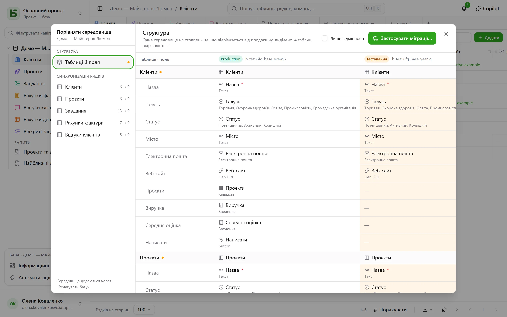

База може мати **середовища**: продакшн, тестування, розробка… Кожне з них — повноцінна
база: її схема, таблиці, рядки, дозволи, — і всі вони мають спільне **походження** бази, її
таблиць і полів.

## В інтерфейсі

Бічна панель показує **один рядок на базу** зі значком, який вказує відкрите середовище й
дає змогу його змінити. Значок не з’являється, доки є лише продакшн.

Середовища додаються, перейменовуються й видаляються в **Редагувати базу…**: нове середовище
створюється як **копія структури** іншого, без його рядків.

## Порівняння середовищ

У меню бази, в розділі **Інші дії**, **Порівняти середовища…** відкриває діалог:

- **Структура**: середовища — у стовпцях, таблиці й поля — у рядках; усе, що відрізняється від
  продакшну, підсвічено.
- **Застосувати міграції…** готує план переходу від одного середовища до іншого, крок за
  кроком. Він ніколи не позначає автоматично те, що скасувало б новішу зміну в цільовому
  середовищі.
- **Синхронізація рядків**: таблиця за таблицею, перенесення рядків з одного середовища в
  інше за ідентифікатором.

## Як basedb знає, хто що змінив

Порівняння спирається на **історію структури**: кожне створення, зміна чи видалення таблиці
або поля фіксується тригером у каталозі й доступне на вкладці «Структура» в історії.
Ідентифікатори походження пов’язують поле з тестування з його відповідником у продакшні, навіть
після перейменування.

## У SQL

Кожне середовище — це схема: `b_t4z56fq_ventes` для продакшну,
`b_t4z56fq_ventes_recette` для тестування. Ваші запити змінюють середовище, змінюючи схему —
або `search_path`.
