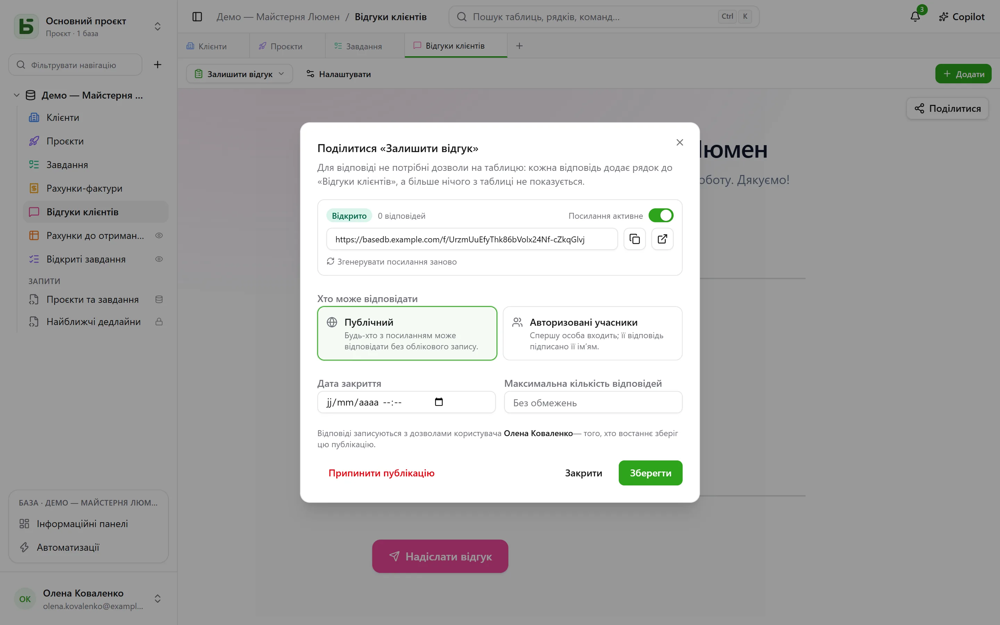

Форму, опитування чи вікторину можна **опублікувати за посиланням** `/f/<jeton>`. Людині, яка
відповідає, **не потрібні жодні дозволи на таблицю**: кожна відповідь додає рядок, і більше
нічого з таблиці їй не показується. Щоб показувати рядки, а не отримувати їх, подання
публікують [лише для читання](/basedb/uk/fonctionnalites/vues-partagees/).

## Хто може відповідати

| Доступ | Хто відповідає | Що показується |
|---|---|---|
| **Публічний** | будь-хто, у кого є посилання, без облікового запису | лише форма |
| **Авторизовані учасники** | учасник робочого простору — за потреби лише з певних груп | вхід, потім форма і «Ви відповідаєте як …» |

Сторінка за посиланням розташована поза застосунком: ні бічної панелі, ні назви бази, ні інших
рядків. Вона має вигляд форми — її тему, колір, шрифт, — і запитує лише ті запитання, яких
вимагають попередні відповіді.

## Від чийого імені записується відповідь

Рядок записується **від імені людини, яка опублікувала форму**, — останньої, хто зберіг
публікацію. Її право створювати рядки перевіряється **під час кожної відповіді** й
обмежується запитаннями форми: якщо вона його втратить, форму буде призупинено, доки хтось, хто
має це право, не збереже її знову.

Історія показує, хто відповів, а не хто опублікував:

- відповідь **учасника** приписується цій людині;
- **публічна** відповідь приписується самій формі: «Форма „Demande de devis“ · публічна
  відповідь · опублікувала Camille».

## Відкриття й закриття

У діалозі налаштовуються:

- перемикач **Посилання активне**;
- **дата закриття**;
- **максимальна кількість відповідей** — точна, навіть за одночасних відповідей;
- **Згенерувати посилання заново**: старе одразу перестає працювати;
- **Припинити публікацію**: посилання зникає, відповіді лишаються в таблиці.

Закрита форма повідомляє про це одним реченням, ще до того, як попросити увійти.

## Опублікована вікторина

Сторінка вікторини не отримує **жодної правильної відповіді** — лише те, скільки важить кожне
запитання. Перевіряє сервер.

- Якщо перевірка налаштована **після кожного питання**, сторінка надсилає йому кожну оцінювану
  відповідь у момент, коли її дають, і тоді дізнається, чи вона правильна, — і якою була
  правильна відповідь.
- Під час надсилання сервер рахує результат **на основі отриманих відповідей** і записує його
  в поле, обране для цього, якщо таке є і якщо особа, яка опублікувала посилання, може його
  записати. Сторінка показує результат, який повертає сервер, і перевірку — якщо вікторина не
  каже «ніколи».

Отже, результат читають у таблиці таким, яким його порахував сервер, а не таким, яким могла б
оголосити його сторінка.

## Обмеження

- Запитання типу **зв’язок**, **файл** і **зображення** не ставляться через опубліковане
  посилання; діалог про це попереджає.
- Надсилання обмежено 20 відповідями на хвилину з однієї адреси для одного посилання. За
  наданим проксі (Caddy) враховується адреса відвідувача.

Докладніше — у [розділі 15](https://github.com/eodia/basedb/blob/main/docs/architecture/15-formulaires-partages.md)
архітектурного документа.
