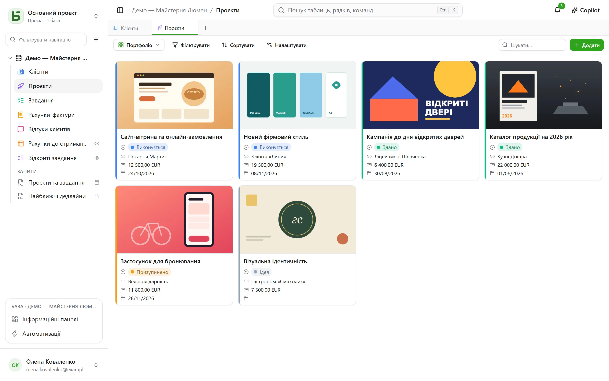
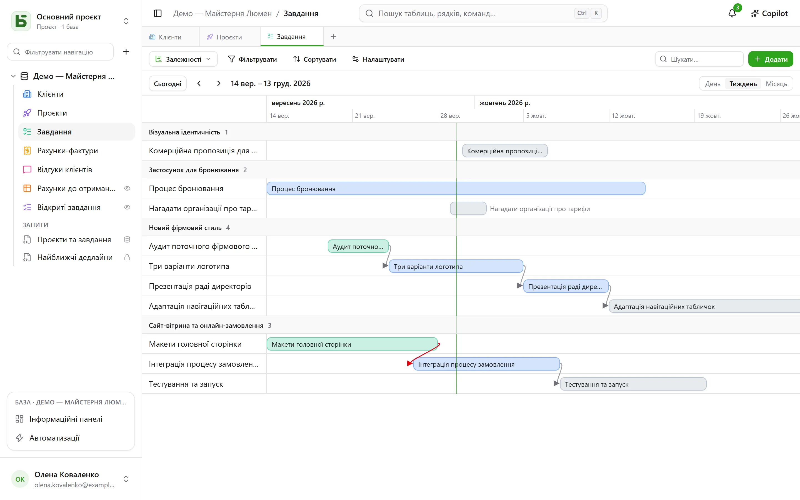
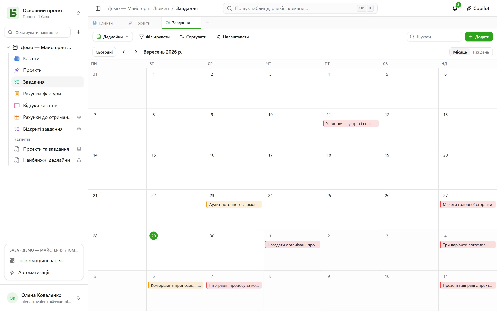
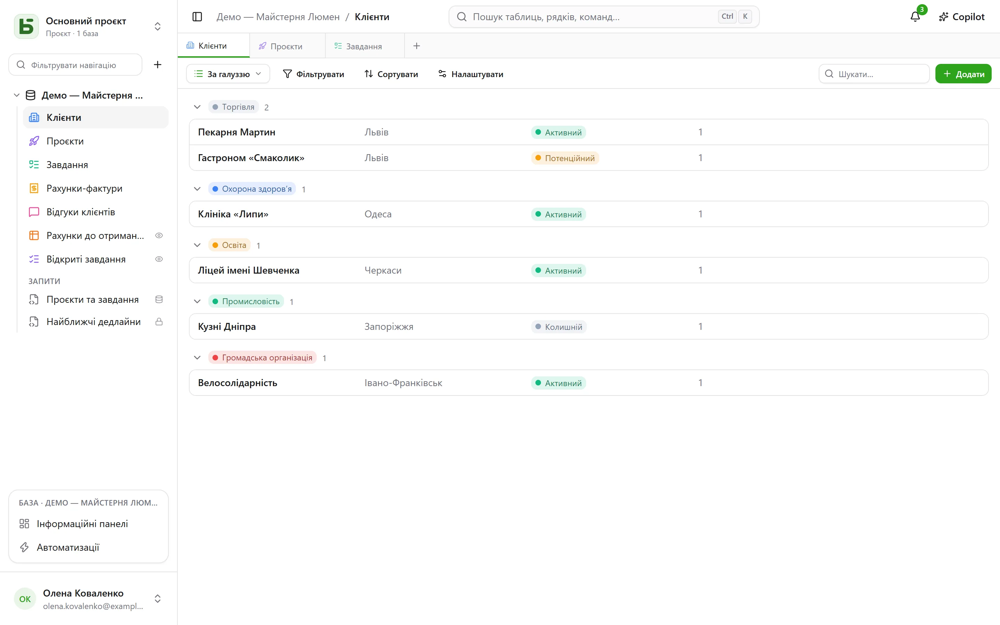

Таблицю можна показати **десятьма способами**. Подання не копіює жодних даних і не надає
більше дозволів, ніж сама таблиця.

:::note
Ці подання — способи показати **одну** таблицю. [SQL-подання](/basedb/uk/fonctionnalites/requetes-et-vues-sql/)
— це інше: справжнє подання PostgreSQL, написане на SQL над таблицями бази й розміщене серед
них на бічній панелі.
:::

| Подання | Що воно показує | Що йому потрібно |
|---|---|---|
| **Сітка** | рядки — відфільтровані, відсортовані, згруповані, з вибраними стовпцями | — |
| **Канбан** | картки в стовпцях | поле одиночного вибору |
| **Календар** | рядки за їхньою датою, помісячно або потижнево | поле дати |
| **Часова шкала** | смуги між двома датами та залежності між ними | дата початку |
| **Галерея** | картки із зображенням-обкладинкою | — |
| **Список** | один рядок на запис, у згортуваних групах | — |
| **Мапа** | кожен рядок, розміщений на мапі | адреса, або широта і довгота |
| **Форма** | сторінка запитань для створення рядка | — |
| **Опитування** | ті самі запитання, по одному на екран | — |
| **Вікторина** | оцінені запитання, по одному на екран, і результат наприкінці | — |

## Перемикач подань

Він розташований ліворуч від «Фільтрувати». «Усі рядки» — це сітка таблиці, яку ніхто не
зберігав і ніхто не може видалити; далі йдуть **спільні подання** в порядку, який вибрав той,
хто будує базу, а потім **Мої подання**. Внизу **Створити подання** розподіляє десять видів
на дві родини: ті, що показують рядки, і ті, що збирають відповіді (форма, опитування,
вікторина).

- **Спільне подання** бачать усі. Його створення, налаштування, перейменування, зміна
  порядку чи видалення потребують рівня **Керування**. Його можна **заблокувати**: про це
  свідчить замок, і ніхто більше не змінить його, доки не розблокує.
- **Особисте подання** бачите лише ви, і для нього достатньо мати змогу читати таблицю.
  **Створити особисте подання** або **Зберегти як подання** після фільтрування й сортування:
  кожен зберігає власні способи читання, нічого не змінюючи для інших. **Дублювати**
  спільне подання — означає створити його особисту копію.

## Панель інструментів

Над сіткою, у такому порядку:

- **Фільтрувати** поєднує умови за полями;
- **Стовпці** визначає, що показується, — системні стовпці винесено окремо, у групу
  «Системна інформація»;
- **Групувати** розкладає рядки за полем з одним значенням — одиночний вибір, зв’язок,
  особа, дата, число, текст, прапорець… — у згортувані групи, кожна з лічильником за всім
  фільтром;
- **Кольори** розфарбовують рядки за полем одиночного вибору або за **правилами** — фільтр і
  колір, не більше двадцяти, — смужкою, фоном або і тим, і тим;
- **Висота рядків**: низька, середня, висока, дуже висока;
- **Пошук…** праворуч шукає в усіх стовпцях, поки ви вводите текст; Esc очищує пошук. Він
  діє також для канбану, календаря, часової шкали, галереї та списку й ніколи не зберігається в
  поданні.

Під кожним стовпцем — **Підсумок**, обчислений за всіма рядками фільтра, а не лише за
сторінкою: заповнені, порожні, унікальні значення, сума, середнє, мінімум, максимум, позначені
прапорці.

## Канбан, календар, часова шкала

- **Канбан** розкладає картки за полем одиночного вибору; перетягування картки змінює рядок,
  а «+» у заголовку стовпця створює рядок, у якому вже вибрано цей варіант. Кожна картка
  показує заголовок, зображення-обкладинку, вибрані поля та **опис**, що посилається на
  значення рядка, — «Доставку заплановано на `{{Date}}` для `{{Client}}`», — який пишуть у
  налаштуваннях подання за допомогою кнопки **Вставити поле**.
- **Календар** розміщує кожен рядок на його даті, з можливою датою завершення; перетягування
  рядка з одного дня на інший зсуває його.
- **Часова шкала** малює смуги між датою початку й датою завершення, згруповані за полем
  одиночного вибору або зв’язком. З налаштуванням **Залежить від** — зв’язком таблиці із самою
  собою — стрілка з’єднує кожне завдання з тими, від яких воно залежить; стрілка стає
  червоною, коли йде назад у часі.

## Галерея та список

- **Галерея** показує картки: **зображення-обкладинку** (обрізане чи ціле), розмір (малі,
  середні, великі картки), колір за полем одиночного вибору.
- **Список** показує один рядок на запис, **згрупований** за полем одиночного вибору,
  зв’язком або особою.

У канбані, галереї та списку картки й рядки можна **впорядковувати вручну**, перетягуючи їх, —
до 5 000; вибране сортування має перевагу над цим порядком.

## Мапа

**Мапа** розміщує кожен рядок на своєму місці за:

- **адресою** — коротким текстом, бажано у форматі **Адреса** (див.
  [Таблиці та поля](/basedb/uk/fonctionnalites/tables-et-champs/)): «вул. Хрещатик, 1, Київ»;
- або за **широтою** і **довготою** — двома числовими полями, узятими такими, як є.

Шпилька набуває **кольору** одиночного вибору, показує **заголовок** рядка при наведенні і
відкриває його деталі за клацанням. Мапа враховує фільтр і сортування подання, до 2000 рядків.

Адреса **визначається один раз і назавжди** службою геокодування екземпляра — типово
OpenStreetMap — у темпі, який вона задає: на новій мапі шпильки з’являються поступово, приблизно
по одній на секунду, а надалі — відразу. Індикатор рахує розміщені рядки, адреси, які ще
визначаються, і ті, що не вдалося визначити: адресу, яку не вдалося знайти, потрібно уточнити
(місто, поштовий індекс), а не мовчки відкинути.

:::note[Що залишає ваш сервер]
Текст адрес надходить до служби геокодування, а браузер кожного читача завантажує основу мапи
із сервера тайлів. Оператор екземпляра може вибрати інші служби або відмовитися від усіх: див.
[Змінні середовища](/basedb/uk/hebergement/variables/#мапи-та-адреси).
:::

## Форма та опитування

Запитання позначають і впорядковують; кожне має формулювання, підказку, приклад відповіді і
може бути обов’язковим. Форма має свій заголовок, вступний текст, підпис кнопки й повідомлення
з подякою. Її заповнюють у basedb або [публікують за посиланням](/basedb/uk/fonctionnalites/formulaires-partages/).

Нічого не треба налаштовувати, щоб почати: нова форма запитує те, що відповідає людина, — не
статус, не відповідальну особу і не зв’язки, які потім заповнює команда, хіба що вони
обов’язкові, — має колір своєї таблиці й світлу тему, а кожне порожнє поле показує підхожий
приклад. Усе інше можна змінити, коли захочете:

- **Зовнішній вигляд**: вісім тем — Світла, Ніжна, Світанок, Океан, Ліс, Ніч, Папір, Мінімальна —, колір акценту, шрифт, вирівнювання ліворуч або по центру;
- **Заповнювати сьогоднішньою датою**: питання з датою вже містить сьогоднішній день — а для дати й часу ще й поточний час, — і людина залишає його або змінює;
- **Запитувати лише якщо…**: запитання ставиться, лише якщо цього вимагає попередня відповідь
  («Настрій — Негативний», «Оцінка не перевищує 2»). Приховане запитання не є обов’язковим і
  не надсилається;
- **Більше параметрів**: кнопки початку й надсилання, номери, індикатор прогресу,
  автоматичний перехід далі, повідомлення й кнопка завершення («Повернутися на сайт»), конфеті.

**Опитування** займає весь екран: вступ, який каже, скільки часу це займе, а тоді — по одному
запитанню за раз, кожне з’являється, наче виїжджаючи. Усе можна робити й з клавіатури:
**Enter**, щоб продовжити, літери **A**, **B**, **C**… для вибору, **Т** або **Н** для так чи
ні, цифри для оцінки — єдиний вибір сам переходить до наступного запитання. Надсилання
святкується: галочка, яка вимальовується, і конфеті кольорів форми.

## Вікторина

Вікторина — це опитування, яке рахує бали. Під кожним запитанням вказують його **правильну
відповідь** і скільки вона дає — **1 бал**, якщо не вказано інше, і до 100:

| Запитання | Правильна відповідь |
|---|---|
| одиночний вибір | один варіант |
| множинний вибір | варіанти, які треба позначити, усі й лише вони |
| прапорець | так чи ні |
| число, оцінка | число |
| дата | день |
| короткий текст, електронна пошта, URL | одна або кілька прийнятних відповідей, розділених `;` — без урахування регістру та діакритичних знаків |

Запитання без правильної відповіді — ім’я, коментар — ставиться, але не оцінюється. Щоб
створити вікторину, потрібне щонайменше одне оцінюване запитання.

Розділ **Оцінювання** налаштовує решту:

- **Перевірка**: **після кожного питання** — відповідь перевіряється одразу, зеленим або
  червоним із показом правильної відповіді, а результат зростає вгорі екрана —, **наприкінці**
  — спочатку результат, потім перевірка —, або **ніколи** — лише результат, правильні
  відповіді залишаються прихованими;
- **Поріг проходження**: відсоток балів; тоді екран завершення показує «Успіх!» або «Не цього
  разу…»;
- **Зберігати результат у**: числове поле таблиці, яке отримує результат кожної відповіді.
  Відсортуйте сітку за ним — ось і рейтинг. Поле з назвою «Score», «Points» або «Note»
  вибирається автоматично.

Екран завершення показує результат у кільці, що заповнюється, відсоток, а потім, якщо не
обрано «ніколи», кожне оцінене запитання з даною відповіддю та правильною. Запитання, яке
приховала попередня відповідь, не враховується в підсумку.

:::note
У застосунку той, хто може читати подання, може прочитати й правильні відповіді. Через
[опубліковане посилання](/basedb/uk/fonctionnalites/formulaires-partages/#опублікована-вікторина),
вони ніколи не залишають сервер: саме він перевіряє і рахує.
:::

## Публікація подання

Подання даних — сітку, канбан, календар, часову шкалу, галерею, список — можна **опублікувати
лише для читання** за посиланням, вбудувати в інший сайт, а календар стає календарною
стрічкою. Див. [Опубліковані подання](/basedb/uk/fonctionnalites/vues-partagees/).

## Чого не бачить читач

Подання **перебудовується для кожного читача**: поле, приховане від нього, зникає зі стовпців,
карток і запитань. Подання, фільтр якого посилається на приховане поле, не показується взагалі:
показане без свого фільтра, воно показало б більше, ніж для нього задумано.
