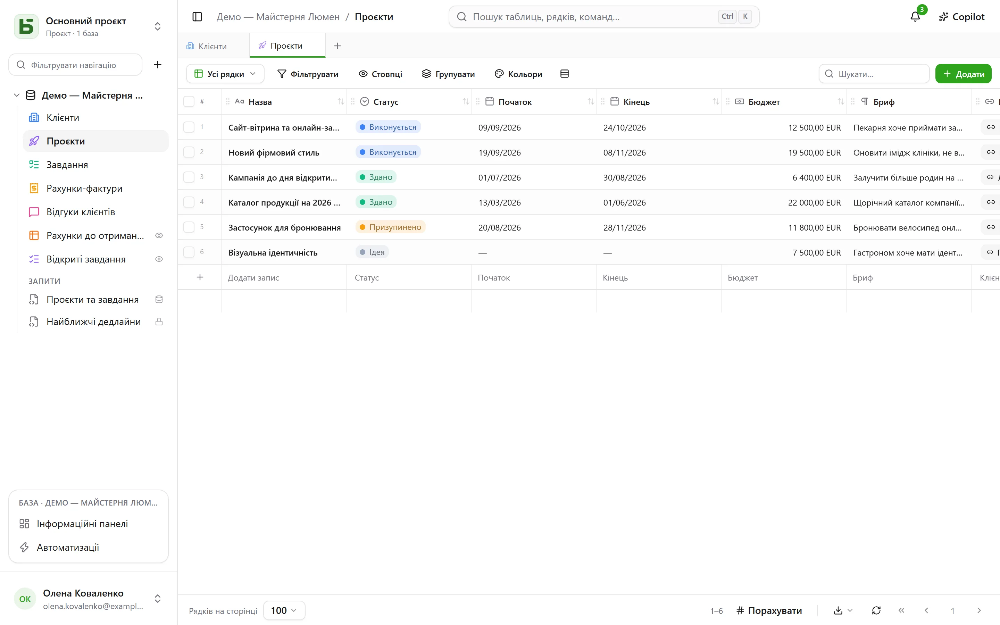

**basedb** — це спільна база даних у дусі спільних електронних таблиць, яку ви розміщуєте
самостійно, — з однією відмінністю, що визначає все інше: **ваші дані живуть у справжніх
таблицях PostgreSQL**, типізованих і названих зрозуміло.

## Проста обіцянка

Жодної узагальненої моделі, жодного `JSONB` «для всього», жодного `field_1837`:

| У basedb | У PostgreSQL |
|---|---|
| База «Ventes» | схема `b_t4z56fq_ventes` |
| Таблиця «Opportunités» | таблиця `opportunites` |
| Поле «Échéance» (Дата) | стовпець `echeance date` |
| Поле одиночного вибору «Statut» | стовпець `text` і його обмеження `CHECK` |
| Зв’язок «Client» | стовпець `clients_id uuid` і його `FOREIGN KEY` |

Тож ви можете відкрити `psql`, BI-інструмент або скрипт на Python і читати свої дані, не
звертаючись до продукту, — і навіть записувати їх: обмеження діють, а історія фіксує запис.

## Для кого?

- **Бізнес-команди**, яким потрібні сітка, подання та форми без очікування на розробку.
- **Технічні команди**, які не хочуть бачити свої дані замкненими в пропрієтарному форматі й
  хочуть підключати звичні інструменти.
- **Агенти ШІ**, які отримують сервер MCP, чіткі дозволи та пропозиції, що їх затверджує
  людина.

## Що ви тут знайдете

- Типізовані [таблиці й поля](/basedb/uk/fonctionnalites/tables-et-champs/), зв’язки, що є
  справжніми зовнішніми ключами — або множинні, — формули, які обчислює PostgreSQL,
  підстановки та зведення через зв’язки.
- Десять [подань](/basedb/uk/fonctionnalites/vues/): сітка, канбан, календар, часова шкала,
  галерея, список, мапа, форма, опитування, вікторина — спільні або особисті.
- [Форми](/basedb/uk/fonctionnalites/formulaires-partages/) та
  [подання](/basedb/uk/fonctionnalites/vues-partagees/), опубліковані за посиланням, і календарі,
  на які можна підписатися зі свого календарного застосунку.
- [Спільна робота](/basedb/uk/fonctionnalites/collaboration/): коментарі та згадки,
  сповіщення, оновлення в реальному часі.
- [Автоматизації](/basedb/uk/fonctionnalites/automatisations/) та
  [інформаційні панелі](/basedb/uk/fonctionnalites/tableaux-de-bord/) з їхніми запитаннями, які створюються мишею або на SQL.
- [SQL для кожного](/basedb/uk/fonctionnalites/requetes-et-vues-sql/) з його власними дозволами:
  збережені запити під таблицями і справжні подання PostgreSQL, розміщені серед них.
- [Шаблони баз](/basedb/uk/fonctionnalites/modeles/), які можна взяти з галереї або
  попросити в ШІ.
- [Середовища](/basedb/uk/fonctionnalites/environnements/) — продакшн, тестування, — які
  порівнюють і між якими переносять зміни.
- [Історія](/basedb/uk/fonctionnalites/historique/) кожного запису, зокрема прямого SQL,
  і Ctrl+Z, щоб скасувати.
- [Дозволи](/basedb/uk/fonctionnalites/droits/) за групами, аж до рівня поля.
- [REST API](/basedb/uk/integrations/api-rest/), [сервер MCP](/basedb/uk/integrations/mcp/),
  [вебхуки](/basedb/uk/integrations/webhooks/), Slack і
  [синхронізовані таблиці](/basedb/uk/integrations/synchronisation/).
- [ШІ](/basedb/uk/fonctionnalites/ia/) як опція: поля, які обчислює модель, Copilot.

## Стан проєкту

basedb — вільне програмне забезпечення (AGPL-3.0), яке розробляє [Eodia](https://eodia.com/fr/),
студія ШІ-орієнтованого програмного забезпечення; проєкт активно розвивається. Ядро, API,
сервер MCP та інтерфейс працюють і покриті понад тисячею тестів;
[дорожня карта](/basedb/uk/feuille-de-route/) розповідає, що ще попереду. Його
[архітектурний документ](https://github.com/eodia/basedb/tree/main/docs/architecture), що
налічує близько двадцяти розділів, фіксує кожне рішення.

:::tip[Спробувати]
Після клонування репозиторію достатньо однієї команди: `docker compose up -d`. Див.
[встановлення](/basedb/uk/guides/installation/).
:::
