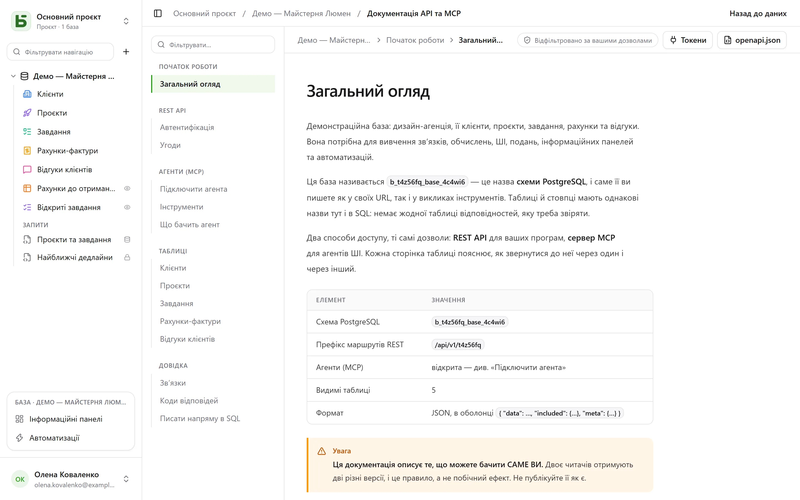

REST API — той самий, яким користується інтерфейс: **приватних маршрутів не існує**. Його URL
містять фізичні назви — ті самі, які ви бачите і в SQL.

```text
/api/v1/<tenant>/data/<base>/<table>
/api/v1/t4z56fq/data/b_t4z56fq_ventes/opportunites
```

## Токен

В інтерфейсі: меню **⋯** бази → **API та агенти** → **Токени API і MCP…**: той, хто має рівень
**Керування** для бази або для її проєкту, після підтвердження пароля створює тут **токен
інтеграції**, обмежений цією базою — усіма її середовищами або лише одним — і типово призначений
лише для читання; обліковий запис без пароля, який входить через постачальника ідентифікації, ще
не може цього зробити. Він показується лише один раз; збережіть його у змінній середовища.

Токен читає; він створює й змінює, якщо його створено з правом запису, і **видаляє, якщо його
створено для цього** — права «Читання, запис і видалення», окрім рядка, який каскадний зв’язок
забрав би разом з іншими. Він ніколи не має більше дозволів, ніж людина, яка його створила.

```bash
export BASEDB_TOKEN=bdb_…
curl "http://localhost:3000/api/v1/t4z56fq/data/b_t4z56fq_ventes/opportunites?limit=20" \
  -H "Authorization: Bearer $BASEDB_TOKEN"
```

## Вибір середовища

База, яка має кілька [середовищ](/basedb/uk/fonctionnalites/environnements/) — продакшн,
тестування… — для токена, створеного на всю базу, лишається **однією** базою. Шлях називає базу
назвою її продакшну, а заголовок `X-Basedb-Environment` вибирає середовище:

```bash
curl "http://localhost:3000/api/v1/t4z56fq/data/b_t4z56fq_ventes/opportunites" \
  -H "Authorization: Bearer $BASEDB_TOKEN" \
  -H "X-Basedb-Environment: recette"
```

- Без заголовка діє середовище, яке називає шлях: `b_t4z56fq_ventes` — це продакшн,
  `b_t4z56fq_ventes_recette` — тестування; обидва записи лишаються чинними.
- `?environment=recette` робить те саме для клієнта, який не ставить заголовків.
- Середовище називається за його значком, без урахування регістру й діакритичних знаків, або
  через `production`. Середовище, якого в базі немає, відповідає `404`, як і будь-який відсутній
  ресурс.
- `GET /api/v1/<tenant>/meta/bases` перелічує кожне середовище з його блоком `environment`
  (`label`, `production`); із заголовком він перелічує лише це.

Токен, обмежений одним середовищем під час створення, не відкриває жодного іншого: заголовок
нічого не змінює. Його права завжди звіряються — середовище за середовищем — з правами людини,
яка його створила.

## Читання

| Параметр | Призначення |
|---|---|
| `filter` | зрозумілий вираз: `statut eq "gagne" and montant gte 10000` |
| `sort` | `-montant,nom` |
| `fields` | стовпці, які треба повернути |
| `limit`, `after` | пагінація зашифрованим курсором: `meta.next_cursor` сторінки, переданий як `after`, дає наступну (`meta.has_next_page`) |
| `links=display` | зв’язки з їхнім значенням відображення |
| `count=exact` | загальна кількість, не більше 100 000 |
| `variables=raw` | довгі тексти в тому вигляді, як їх записано, разом із `{{colonne}}`, а не зі [значеннями рядка](/basedb/uk/fonctionnalites/tables-et-champs/#форматований-текст-і-змінні) |

Оператори: `eq`, `ne`, `eq_ci`, `contains`, `starts_with`, `ends_with`, `in`, `is_null`,
`gt`, `gte`, `lt`, `lte`, `between`, які поєднуються через `and`, `or`, `not` і дужки. Фільтр
проходить через зв’язок: `clients_id.ville eq "Lyon"`.

## Запис

```bash
curl -X POST "http://localhost:3000/api/v1/t4z56fq/data/b_t4z56fq_ventes/opportunites" \
  -H "Authorization: Bearer $BASEDB_TOKEN" -H "content-type: application/json" \
  -d '{"values": {"nom": "Audit RGPD", "statut": "nouveau", "montant": 12000}}'
```

`PATCH …/<table>/<_id>` змінює рядок із тим самим тілом `{"values": {…}}`. Помилки мають
єдину форму: `{ "code": "…", "details": {…}, "request_id": "…" }` зі стабільним кодом для
кожної причини.

Кожен запис повертає заголовок `x-basedb-transaction`: якщо передати його в
`POST /api/v1/<tenant>/history/undo` (`{"transaction": "…"}`), запис буде скасовано, як за
Ctrl+Z в інтерфейсі, — або відхилено, якщо рядок відтоді змінився.

## Поза межами рядків

З тим самим токеном:

| Маршрут | Призначення |
|---|---|
| `GET …/data/<base>/<table>/aggregate` | підсумки за всіма рядками фільтра: `aggregates=montant:sum,nom:filled`, `group=statut` |
| `GET …/data/<base>/<table>/<_id>/comments`, `POST` | читання й запис коментарів рядка |
| `POST /api/v1/<tenant>/automations/<id>/run` | запуск автоматизації з тригером «кнопка» для рядка (`{"record": "…"}`) |
| `GET /api/v1/<tenant>/meta/bases/<base>/dashboards` | інформаційні панелі бази |
| `GET /api/v1/<tenant>/meta/users` | учасники робочого простору для поля «Особа» |
| `GET /api/v1/<tenant>/meta/templates` | шаблони баз із галереї |
| `GET /api/v1/<tenant>/events?base=<base>&table=<table>` | стежити за таблицею в реальному часі: сигнали, які потім перечитуються наведеними вище маршрутами (див. [Вебхуки](/basedb/uk/integrations/webhooks/#без-вебхука-стежити-за-таблицею)) |

[Опубліковані подання](/basedb/uk/fonctionnalites/vues-partagees/) читаються без облікового
запису: `GET /api/v1/views/<jeton>` і `…/rows` у JSON, `…/calendar.ics` в iCalendar.

Побудова — створення автоматизації, інформаційної панелі, інтеграції — доступна лише в сеансі
інтерфейсу: токен читає й записує рядки, але не змінює базу.

## Кольори та піктограми

Таблиця та кожен варіант списку вибору мають колір (`color`, `#rrggbb`) і піктограму (`icon`,
назва піктограми [Lucide](https://lucide.dev/icons/), яку малює інтерфейс: `truck`,
`circle-check`, `flame`…). `GET …/meta/bases/<base>` повертає їх для бази, її таблиць і варіантів
її полів.

Щоб їх вибрати, скористайтеся токеном доступу людини, яка може змінювати структуру
(`POST /auth/session/access`) — токен інтеграції не змінює базу:

| Маршрут | Тіло |
|---|---|
| `POST …/admin/bases/<base>/tables` | `{"label": "Tickets", "color": "#dc2626", "icon": "flame", "fields": […]}` |
| `PATCH …/admin/bases/<base>/tables/<table>` | `{"color": "#2563eb", "icon": "inbox"}` — три ключі `color`, `icon`, `image` передаються разом: назвати один із них означає замінити всі три |
| `POST …/admin/bases/<base>/tables/<table>/fields` | `{"label": "Priorité", "kind": "select", "options": [{"value": "haute", "color": "#dc2626", "icon": "flame"}, …]}` |
| `PUT …/admin/bases/<base>/tables/<table>/fields/<champ>/options` | увесь список варіантів, по порядку, кожен зі своїм кольором і піктограмою |

Агент користується [сервером MCP](/basedb/uk/integrations/mcp/#кольори-та-піктограми), де він
**пропонує** ці зміни. Поле не має піктограми для вибору: інтерфейс малює піктограму його типу.

## Створення бази з шаблону

Застосунок, що встановлюється, створює свою базу **одним викликом**: сервер застосовує
шаблон — таблиці, поля, зв’язки, приклади рядків, подання, інформаційні панелі, автоматизації —
і, якщо якийсь крок завершується помилкою, не залишає по собі жодної бази.

```bash
curl -X POST "http://localhost:3000/api/v1/t4z56fq/admin/bases" \
  -H "Authorization: Bearer $ACCES" -H "content-type: application/json" \
  -d '{"template": "crm", "label": "Ventes", "rows": false}'
```

`template` — ключ шаблону з галереї або цілий шаблон у
[форматі шаблонів](/basedb/uk/fonctionnalites/modeles/). З заголовком
`Accept: application/x-ndjson` відповідь надходить рядок за рядком: один рядок `{"step": …}` на
кожен крок, а потім створена база. Цей виклик вимагає токена доступу людини, яка може створювати
базу (`POST /auth/session/access`, після входу): токен інтеграції відкриває лише наявну базу.

## Перевірка токена

Токени basedb не можна перевірити поза basedb. Застосунок, який отримує такий токен —
наприклад, інструмент, відкритий із basedb з токеном людини, — запитує, чого він вартий
(інтроспекція, RFC 7662), своїм власним токеном інтеграції:

```bash
curl -X POST "http://localhost:3000/auth/introspect" \
  -H "Authorization: Bearer $BASEDB_TOKEN" \
  --data-urlencode "token=$JETON_RECU"
```

```json
{ "active": true, "token_type": "access_token",
  "sub": "0195a…", "email": "claire@example.com", "name": "Claire Martin",
  "tenant": "t4z56fq", "groups": ["Commerciaux"], "exp": 1790000000 }
```

Будь-який токен, що не є дійсним, — невідомий, прострочений, відкликаний, сеанс закрито,
інший робочий простір — відповідає `{"active": false}`, не пояснюючи причини. Відповідь
читається в реальному часі: вихід із сеансу видно одразу. Для токена інтеграції відповідь
також показує базу, яку він відкриває (`base`, її продакшн), чи відкриває він усі середовища
(`environments`: `all`), чи одне (`one`), його доступ (`read`, `write` або `delete`) і його
поверхні.

## Згенерована документація

Кожна база має сторінку **Документація API та MCP**: для кожної таблиці — її кінцеві точки,
стовпці, приклади на cURL і JavaScript. Вона **відфільтрована за вашими дозволами** — двоє
читачів отримують дві різні версії, — написана **мовою вашого екрана**, і також доступна у
форматі OpenAPI 3.1 (`/api/v1/<tenant>/meta/bases/<base>/openapi.json`), який оголошує токен
Bearer і заголовок `X-Basedb-Environment`. Назви, шляхи та коди помилок лишаються однаковими в
усіх мовах.


