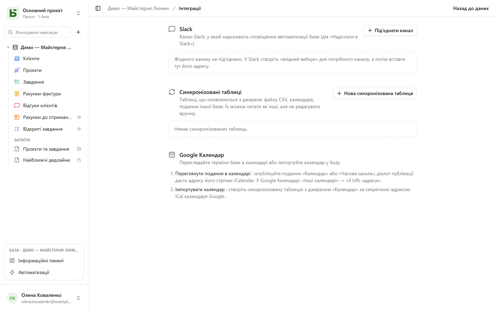

Екран **Інтеграції** бази відкривається з меню профілю внизу ліворуч. Він потребує рівня
**Керування** й збирає все, що пов’язує базу з рештою ваших інструментів.

## Slack

**Підключити канал**: у Slack створіть *вхідний вебхук* для потрібного каналу, а потім вставте
його адресу (`https://hooks.slack.com/…` — єдине дозволене джерело). **Перевірити** надсилає
тестове повідомлення. Адресу шифрують одразу під час збереження, і вона більше ніколи не
показується.

Далі підключений канал стає дією [автоматизацій](/basedb/uk/fonctionnalites/automatisations/):
**Надіслати в Slack** з повідомленням, яке посилається на рядок, — «Новий негативний відгук від
{{Auteur}}: {{Avis}}».

## Календарі

Два напрямки, два способи:

- **Бачити подання в календарі**: опублікуйте публічно подання «Календар» або «Часова шкала»;
  його діалог публікації надає адресу **стрічки iCalendar**, на яку можна підписатися в Google
  Календарі («Інші календарі» → «З URL-адреси»), Outlook або Apple Calendar. Див.
  [Опубліковані подання](/basedb/uk/fonctionnalites/vues-partagees/#календар-у-вашому-календарному-застосунку).
- **Імпортувати календар**: створіть синхронізовану таблицю з джерелом «Календар» і секретною
  адресою iCal цього календаря.

## Синхронізовані таблиці

Синхронізована таблиця **підтримується в актуальному стані з джерела**: її читають, фільтрують
і показують у поданнях, як і інші, але не редагують вручну — про це нагадує значок
«Синхронізована», а API відхиляє будь-який запис (`TABLE_SYNCED`).

| Джерело | Чим стає таблиця |
|---|---|
| **CSV-файл в інтернеті** | один стовпець на кожен стовпець файлу, тип визначається за вмістом: число, дата чи текст |
| **Календар** (Google Календар, iCalendar) | одна подія на рядок: назва, початок, кінець, місце, опис |
| **Опубліковане подання basedb** | рядки [опублікованого подання](/basedb/uk/fonctionnalites/vues-partagees/#джерело-для-інших-баз) на цьому чи іншому екземплярі |

**Нова синхронізована таблиця** задає джерело та інтервал — від кожних 15 хвилин до одного
разу на день; **Синхронізувати** перечитує джерело негайно. Кожен прохід створює, змінює й
видаляє все потрібне, щоб таблиця відповідала джерелу, орієнтуючись на поле
**Ключ синхронізації**. Усі ці записи проходять через історію.

**Зупинити** синхронізацію — і таблиця стане звичайною: її рядки лишаться, і їх знову можна
редагувати вручну.

## Обмеження

- Джерело читається в межах 5 МБ, 10 000 рядків і 10 секунд.
- Джерело, що дало збій, нічого не стирає: таблиця зберігає свої рядки до наступного проходу.
- Стовпець, що з’явився в джерелі після створення таблиці, не додається.
- Slack підключається через вхідний вебхук, поки що не через застосунок Slack.
