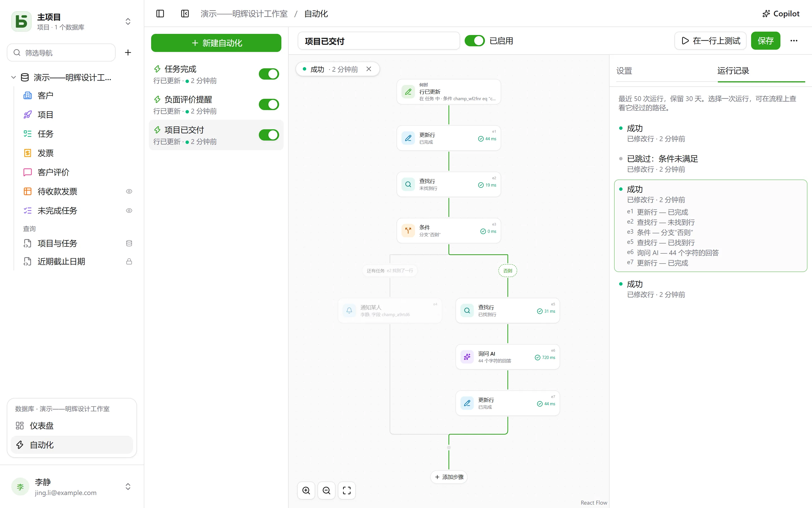

自动化说明**何时**、**是否**以及**然后做什么**：任务变为“Fait”时，记录时间；收到差评时，通知负责人并发送到 Slack；每周一上午 9 点，创建团队例会的行。当一个操作不够用时，它会按照一个**流程**执行：查找一行，根据其内容走不同的分支，对符合筛选条件的每一行重复执行步骤，在后续步骤中复用前面步骤找到或写入的内容，在发出提醒前先**等待**三天，并将**PDF**作为附件发送。

自动化从侧边栏底部当前数据库区块中的**自动化**入口打开，需要**可管理**级别。



## 流程

流程从上到下绘制：先是触发器，然后是各个步骤。连线上的 **+** 会打开按类别——行、沟通、文档、AI、逻辑——分组并带搜索的步骤列表，将选中的步骤添加到该位置；点击卡片会在右侧打开其设置。简单的自动化——一个触发器加一个操作——只需两张卡片，设置方式与以前相同。

## 何时

| 触发器 | 设置 |
|---|---|
| **创建了一行** | 数据表 |
| **修改了一行** | 数据表，以及（可选）仅需监视的字段 |
| **定时** | 每小时、每天或每周，在所选时间和时区执行 |
| **点击按钮** | 数据表中的一个[按钮字段](/basedb/zh-cn/fonctionnalites/tables-et-champs/#按钮) |
| **行被删除** | 数据表；各步骤引用的是该行被删除前的状态 |
| **行进入筛选** | 数据表与筛选条件：行进入该筛选条件时自动化即启动，并要等它先离开该筛选条件后才会再次启动——例如“一张发票变为逾期”，而不是“一张已逾期的发票被修改” |
| **日期到达** | 数据表中的某个日期字段、一个偏移量——提前三天、当天、之后一周——以及时间：到期提醒、合同纪念日 |
| **收到 Webhook** | 无需设置：自动化会获得专属地址，供其他软件调用（[详情](#调用-basedb-的服务)） |

基于行的触发器能看到**所有**写入：界面、API、智能体、共享表单，甚至直接 SQL——自动化源自历史记录，而历史记录会捕获所有写入。

## 仅当

一个可选条件，使用[筛选语言](/basedb/zh-cn/integrations/api-rest/#读取)编写——`statut eq "fait"`、`montant gte 10000 and payee eq false`——在**执行操作时**针对该行求值。条件不满足的运行会被“跳过”，并注明原因。

## 然后

最多四十个步骤，按顺序执行；第一个失败的步骤会终止后续步骤——**尝试**块中的步骤除外（[详情](#尝试)）。

| 步骤 | 作用 |
|---|---|
| **修改行** | 将值写入触发的行——或写入某个步骤找到或创建的行 |
| **创建行** | 在本数据表或本数据库的另一张数据表中创建 |
| **查找行** | 在数据表中找到符合筛选条件的第一行，供后续步骤引用或修改 |
| **通知他人** | 向选定的人员或某个人员字段中的人员发送[通知](/basedb/zh-cn/fonctionnalites/collaboration/#通知) |
| **发送邮件** | 发送给选定的成员、人员字段中指定的人、电子邮件字段中的地址——客户、供应商——或手动填写的地址；主题和正文可以引用该行以及前面的步骤 |
| **调用 Webhook** | 向服务发送 HTTPS 请求——方法、地址、标头和正文均由您决定（[详情](#调用服务)）；随后可引用其响应 |
| **发送到 Slack** | 向[已连接](/basedb/zh-cn/integrations/synchronisation/#slack)的频道发送消息 |
| **询问 AI** | 向 [AI 服务商](/basedb/zh-cn/fonctionnalites/ia/)发送一条引用该行及前序步骤的指令并获取回答——撰写、总结、分类——回答可解读为文本、数字、是或否、日期或列表中的一个选项 |
| **条件** | 多个分支：选择第一个条件满足的分支，都不满足时走“否则”；各分支随后汇合 |
| **遍历行** | 其中包含的步骤，对数据表中符合筛选条件的每一行各执行一次（[详情](#遍历行)） |
| **删除一行** | 触发该步骤的行，或某个步骤所找到的行——它会被放入回收站 |
| **统计** | 某个筛选条件下的行数、总和、平均值、最小值或最大值，供之后引用或判断 |
| **生成 PDF** | 某一行的[文档](/basedb/zh-cn/fonctionnalites/documents/)，存入文件字段，或作为邮件附件 |
| **等待** | 一段时长，或等到某个字段的日期（[详情](#等待)） |
| **尝试** | 一组步骤，以及其中某一步失败时要执行的另一组步骤（[详情](#尝试)） |
| **运行自动化** | 本数据库的另一个自动化，作用于其数据表的某一行 |

没有找到结果的查找不会中止流程：本应修改所找到行的步骤会被跳过。如果想在这种情况下执行其他操作，可以在查找步骤下方，用<strong>如果未找到任何行……</strong>添加一个判断条件。

一个**条件**可以用筛选条件判断一行，也可以判断一个**值**：AI 的回答、某个 webhook 的状态码、一个统计结果——例如“`{{e2.reponse}}` 等于 Urgent”，“`{{e3.somme.montant}}` 大于或等于 1000”。数字按数字比较，文本则忽略大小写和重音符号。

## 遍历行

**遍历行**步骤会按所选顺序，读取数据表中符合其筛选条件的行——筛选条件为空则是全部——直到达到其上限（默认 50，最多 200），然后对每一行执行一次其框内的步骤。“每周一提醒所有未付的发票”可以这样实现：**按设定时间**触发，然后对发票**遍历行**，筛选条件为 `payee eq false and relancee eq false`，在循环中给发票的联系人发送一封邮件，并用**更新行**勾选“Relancée”。

在循环中，步骤的标识符指代**本轮的行**：`{{e1.client}}` 引用它，**更新行**会将它列入可修改的行之中。循环结束后，`{{e1.nombre}}` 表示它遍历过的行数——例如可用于 Slack 上的汇总消息。筛选条件可以引用之前的内容：由一张已付款的发票触发时，`facture eq {{_id}}` 会遍历它的明细行。

超出上限的行会等待下一次运行，届时会提示这一点：请让已处理的行不再符合筛选条件——例如一个“relancée”复选框，或一个日期——这样它们才会在多次运行中被逐步处理完。循环内不能再嵌套循环，且一次运行最多持续两分钟。

## 等待

**等待**步骤会让运行暂停——三小时、两天——或暂停到某一行某个字段的日期，并附带一个偏移量和一个时间：“到期前一天，上午 9 点”。该运行会在**运行记录**标签页中显示为**已暂停**，并注明恢复的日期。

它会在下一步**重新读取**相关行后继续执行：“报价单发出三天后，如果仍未被接受，发出提醒”可以写成**等待** 3 天，然后用一个条件判断报价单当天的状态。停用自动化会终止处于暂停状态的运行；等待步骤不能放在循环或**尝试**块中，且最长持续一年。

## 尝试

**尝试**块有两条分支。第一条会先执行；如果其中某一步失败，流程会转到第二条分支，即**失败时**，它会引用这次失败——`{{e4.erreur}}` 为错误代码，`{{e4.etape}}` 为出错的步骤——随后在该块之后继续执行。这样即可在某个服务无响应时通知某人，而不必终止整个流程。

更简单的情况下：Webhook 可以在服务故障后自行**重试**最多三次，循环也可以在某一行失败时**继续**执行。

## PDF 与邮件

**生成 PDF** 会为一行生成文档——使用其数据表的某个[文档模板](/basedb/zh-cn/fonctionnalites/documents/)，或包含全部字段的详情页——并可以将其存入一个文件字段。**发送邮件**随后可以将其作为附件，连同某个文件字段或图片字段中的文件一起发送：

- **每人一封**邮件，或**统一发送给所有人**，并可设置**抄送**收件人；
- 引用该行内容的**富文本**消息——粗体、列表、链接；
- 一个**回复**地址：默认为您自己的地址，或取自某个电子邮件字段；
- 最多 50 个收件人、10 个附件，且不超过 15 MB。

“当报价单变为已接受时，把发票发给客户，并将财务抄送”：**行进入筛选** `statut eq "accepte"`，**生成 PDF** 时使用发票模板，**发送邮件**至客户的电子邮件字段，并附上发票。

## 调用 basedb 的服务

使用**收到 Webhook** 触发器时，自动化会拥有自己的专属密钥地址，可以把它交给需要启动它的软件——一个在线商店、一个外部表单、一个自动化工具：

```bash
curl -X POST "https://basedb.example.com/api/v1/hooks/<secret>" \
  -H "content-type: application/json" \
  -d '{"client": {"nom": "Dupont"}, "total": 120}'
```

步骤可以引用它收到的内容：`{{trigger.client.nom}}`、`{{trigger.total}}`；表单的读取方式相同，文本则通过 `{{trigger.texte}}`。该地址可以从触发器的设置中复制；**更改地址**会替换它，旧地址随即失效。一次调用会收到 `202`，自动化会在一秒内运行。

## 调用服务

**调用 Webhook** 步骤默认以 `POST` 方式发送自动化数据：所选的行，以及前序步骤找到或写入的内容。若要按某个服务的要求与其通信，可以设置：

- **方法**：`POST`、`PUT`、`PATCH`、`GET` 或 `DELETE`——后两者不带正文；
- **地址**，可以在主机之后引用值——如 `https://api.exemple.fr/clients/{{e2.numero}}`；每个值都会被编码；
- **标头**，其值可以引用：`Idempotency-Key: {{_id}}`；
- **正文**：自动化数据、**要编写的 JSON**、**表单**（每行一个 `键=值` 键值对）或**文本**。在 JSON 中，引号内的引用是文本，引号外的引用是一个值——数字、是或否、列表：

```json
{ "facture": "{{e1.numero}}", "montant": {{e1.montant}}, "payee": {{e1.payee}} }
```

API 密钥或令牌应放入一个**保密**标头（锁形图标）：由实例密钥加密后，它不会再被显示——无论在界面上、通过 API，还是对 Copilot——并且只会发往您为其指定的主机。更改地址的主机后需要重新输入；**替换**可输入新的值。

## 询问 AI

与 [AI 字段](/basedb/zh-cn/fonctionnalites/ia/#字段的-ai-选项)一样，该步骤会将其指令发送给服务商，其中每处引用都会替换为对应的值：

```text
Cet avis de {{auteur}} demande-t-il une action de notre part ? {{avis}}
```

您需要选择**预期回答**：自由文本或短文本、数字、是或否、日期、网址，或列表中的一个选项（选项可沿用某个单选字段的选项）。模型会被告知这一要求，如果回答中不包含所需内容，该步骤就会失败。后续步骤通过 `{{e1.reponse}}` 引用该回答：可用于新建任务的标题、消息，或单选字段——回答会被归入显示名称相同的选项。

指令中引用的内容会发送给服务商：该步骤需要您的**同意**，指令变更后需重新同意。每次调用都会记录日志，并与 AI 字段一起计入 `BASEDB_AI_FIELD_QUOTA`（默认每小时 300 次）。AI 本身不会执行任何操作：真正写入或发送通知的是位于它之后的步骤。

## 引用

值、消息和筛选条件都可以通过每个文本框旁的 **{ }** 按钮引用之前的内容：

- `{{Titre}}`、`{{_id}}`：触发的行；
- `{{e2.titre}}`、`{{e2._id}}`：步骤 `e2` 找到、创建或修改的行——每个步骤的标识符都显示在其卡片上；
- `{{e3.statut}}`、`{{e3.reponse.numero}}`：Webhook `e3` 的响应内容；
- `{{e4.reponse}}`：AI 步骤 `e4` 的回答；
- `{{e5.client}}` 在循环 `e5` 中，表示本轮的行；`{{e5.nombre}}` 在循环之后，表示遍历过的行数；
- `{{e6.nombre}}`、`{{e6.somme.montant}}`、`{{e6.moyenne.montant}}`、`{{e6.max.echeance}}`：步骤 `e6` 统计得到的结果；
- `{{e7.erreur}}`、`{{e7.etape}}`：**尝试**块 `e7` 所捕获的失败信息；
- `{{e8.nom}}`：步骤 `e8` 生成的 PDF 名称；
- `{{trigger.client.nom}}`：传入 Webhook 发送的内容；
- `{{_maintenant}}`：本次运行的时刻。

仅由一个引用构成的值会传递该值本身：关联、人员、选项——新建的行正是这样与查找到的行建立关联的。在筛选条件中，引用始终是被比较的值，绝不会被当作筛选语言解析。

步骤只能引用在它之前必定已经发生的内容：某个分支找到的内容，在条件之后就不能再引用。编辑器会在保存前在卡片上提示这一点。

## Copilot

标题栏中的 **Copilot** 会在右侧打开一个对话，用自然语言讨论数据库的自动化：“当任务进入审核时，通知负责人”、“用 AI 在备注中添加摘要”、“上一次运行为什么失败？”。它会给出回答，并**提议**一个完整的自动化——修改当前屏幕上的那个，或新建一个——同时列出所有变更。

Copilot 不会保存任何内容：**放到流程中**会在编辑器中显示该提议，您可以在保存前进行检查——卡片上的**撤销**会将流程恢复原样。新的自动化会在编辑器中打开，等待创建。每个提议都会像保存时一样接受校验；无法成立的部分会被剔除，并加以说明。

默认情况下，**只有结构**会与对话一起发送给 AI 服务商：数据表及其字段、数据库的自动化、编辑器中显示的当前自动化，以及它最近的运行记录——状态和错误代码，从不包含任何值。人员和 Slack 频道以代号（`p1`、`s1`）发送，从不使用其标识符。勾选**允许读取数据**后，Copilot 可在本次对话中读取行（每次最多 50 行），每次读取都会列在其回答下方。

## 测试与跟踪

**在一行上测试**会在选定的行上真实地运行已保存的自动化。**运行记录**标签页保留最近 50 次运行，保存 30 天：等待中、运行中、成功、已跳过（附原因）、失败（附错误代码）。选择其中一次，它会叠加显示在流程上——所走的分支会被标出，每个经过的步骤会说明它做了什么、用了多长时间，其余部分则变淡显示。在循环中，每个步骤还会说明它运行了多少次。

## 以谁的名义执行

自动化以**最后保存它的人的权限**执行，并在每次运行时重新判定：如果此人失去某项权限，需要该权限的步骤会失败，而不是绕过权限；查找也只能找到此人可读取的内容。历史记录中显示为“自动化‘Tâche terminée’ · 代表 …”，其写入也可以像其他写入一样撤销。

## 限制

- 自动化写入的内容不会触发其他自动化：需要串联的操作应写在同一个流程中，或通过**运行自动化**连接，最多三层。
- 查找只会返回一行，即第一行；一次循环每次运行最多遍历 200 行。一次运行最多持续两分钟，等待时间不计入其中。
- 不支持脚本。邮件通过实例的[发送服务器](/basedb/zh-cn/hebergement/variables/#邮件)发出。
- [数据库模板](/basedb/zh-cn/fonctionnalites/modeles/)只会带上不含查找、循环、条件或 AI 步骤的自动化，且绝不包含 Webhook。
- Webhook 不会跟随重定向，最多等待 10 秒；非 2xx 的响应会在重试后使该步骤失败。
- 到达的日期每分钟检查一次；只计入自动化保存之后到达的日期。
- 每个自动化每小时最多运行 100 次；错过的定时执行只会补跑一次。
- 从写入到执行操作的延迟约为一秒。
