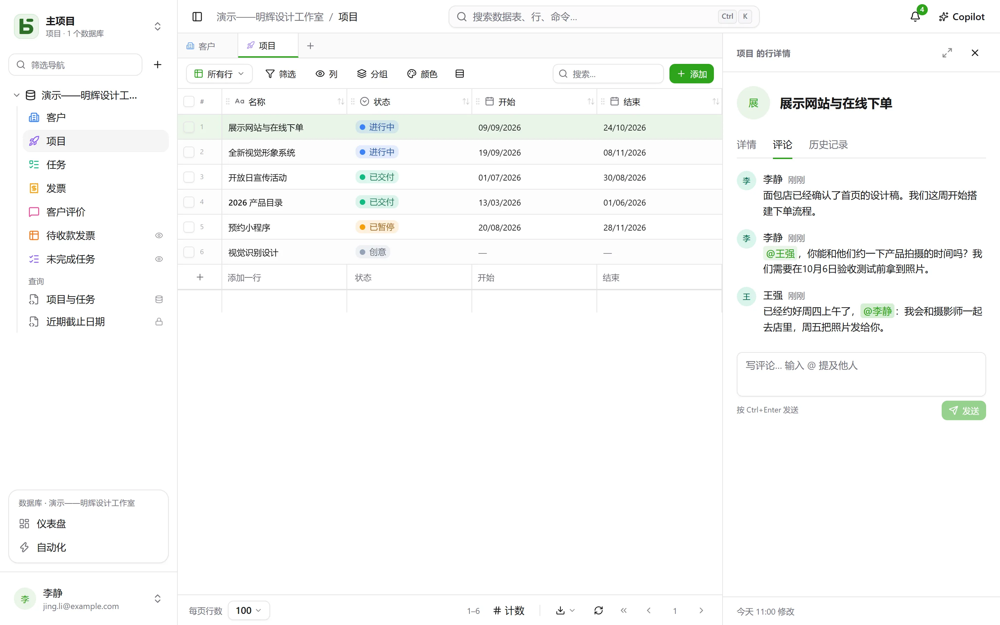
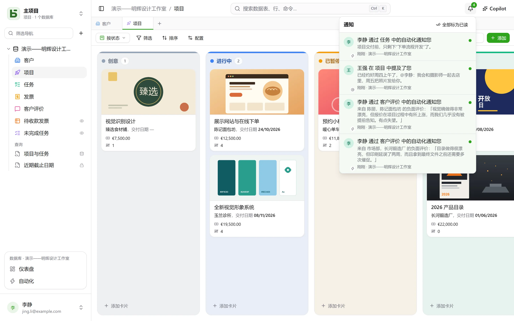

多人可以同时在同一个数据库中工作：每个人都能看到他人的写入实时到达，知道谁在看什么，并能直接在某一行上展开讨论。

## 评论

行详情中有一个**评论**标签页，位于“详情”和“历史记录”之间。输入 `@` 可**提及**成员，按 Ctrl+Enter 发送。每个人都可以编辑或删除自己的评论。

能读取某一行，就能评论它。被提及的人如果无权读取该行，将不会收到通知——作者会收到提示，而不会误以为消息已经送达。

## 通知

右上角的铃铛显示未读数量。以下四种情况会产生通知：

- 有人在评论中**提及**您；
- 有人在您参与过的讨论中**回复**；
- 有人在人员字段中**指定**了您——无论是通过界面、API、表单还是自动化；
- 某个[自动化](/basedb/zh-cn/fonctionnalites/automatisations/)向您**发送通知**。

打开通知即会打开对应的行。**全部标为已读**会清空计数；通知保留 90 天。

### 通过邮件

当实例配置了[发送服务器](/basedb/zh-cn/hebergement/variables/#邮件)时，保持**十分钟未读**的通知也会通过邮件发送：所有等待中的通知合并成一封邮件，附上指向每一行的链接。及时读到的通知则不会发送。在**设置 › 通知**中，每种通知都有两个开关：在 basedb 内，以及通过邮件。

## 实时更新

他人的写入**无需刷新**即可显示：修改的单元格、移动的卡片、新增的行——无论来自界面、API、智能体还是直接 SQL。服务器只发送一个**信号**，从不发送数据：由界面以您的权限重新读取。您正在编辑的单元格绝不会在您输入时被替换。

## 在线状态

正在查看**同一张数据表**的人，其头像会显示在界面顶部；打开了**同一行**的人，其头像会显示在该行详情的标题栏中。在网格中，其他人的指针会出现在他们悬停的单元格上。

## 指向每个屏幕的链接

浏览器地址会跟随您正在查看的内容：一张数据表、它的某个视图、某一行的详情、一个仪表盘、一个自动化、一个问题，或者您的设置。把它粘贴到消息里，同事就能到达同一个位置，并按自己的权限查看。把它加入收藏夹；浏览器的前进和后退按钮会带您回到之前所在的位置。

| 地址 | 打开的内容 |
|---|---|
| `/bases/ventes/tables/opportunites` | 数据库“Ventes”中的数据表“Opportunités” |
| `/bases/ventes/tables/opportunites?vue=…` | 它的某个视图 |
| `/bases/ventes/tables/opportunites?ligne=…` | 其中一行的详情 |
| `/bases/ventes/tableaux-de-bord/…` | 一个仪表盘 |
| `/bases/ventes/automatisations/…` | 一个自动化 |
| `/parametres/apparence` | 您的设置 |

地址指向的是一个**位置**，而不是您离开时的状态：筛选、排序和列宽由每个浏览器各自保留。数据库和数据表在地址中以其 PostgreSQL 名称出现：重命名后，旧地址将无法访问任何内容。无法访问的地址——拼写错误、对象已被删除，或者您无权查看——会显示“此页面不存在”。

## 撤销

Ctrl+Z 可撤销您最近一次写入——参见[历史记录](/basedb/zh-cn/fonctionnalites/historique/#撤销ctrlz)。

## 限制

- 没有运维人员配置的发送服务器，就不会发出任何邮件。
- 一次更改超过一百行时，界面会重新加载整个页面，而不是逐行更新。
