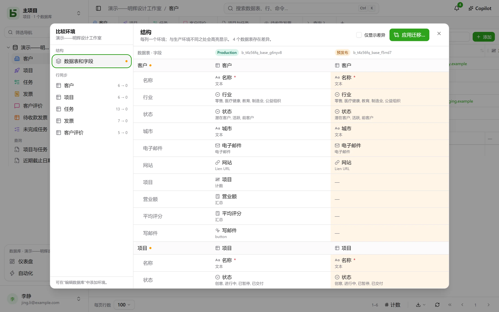

数据库可以有多个**环境**：生产、预发布、开发…… 每个环境都是一个完整的数据库——有自己的模式（schema）、数据表、行和权限——所有环境共享该数据库及其数据表和字段的**谱系**。

## 在界面中

侧边栏中**每个数据库只显示一行**，并带有一个徽标，标明当前打开的环境，也可用于切换环境。只有生产环境时不显示该徽标。

打开**编辑数据库…**，即可添加、重命名和删除环境：新环境由另一个环境的**结构副本**生成，不含其中的行。

## 比较环境

在数据库菜单的**更多操作**下，**比较环境…** 会打开一个对话框：

- **结构**：各环境为列，数据表和字段为行；与生产环境不同之处会高亮显示。
- **应用迁移…** 会准备从一个环境迁移到另一个环境的计划，逐步执行。它绝不会默认勾选那些会撤销目标环境中较新修改的步骤。
- **行同步**：逐张数据表将行从一个环境同步到另一个环境，按标识符匹配。

## basedb 如何知道谁改了什么

比较依据的是**结构历史记录**：每次创建、修改或删除数据表或字段，都会由目录（catalog）上的触发器捕获，并可在历史记录的“结构”标签页中查看。谱系标识符会将预发布环境中的字段与其在生产环境中的对应字段关联起来，即使字段已被重命名。

## 通过 API、SDK 和 MCP

**为整个数据库创建的令牌**可以打开其所有环境，无论是现有的还是日后添加的：一个令牌即可覆盖生产环境和预发布环境。程序或智能体在每次调用时选择环境：

| 位置 | 方式 |
|---|---|
| [REST API](/basedb/zh-cn/integrations/api-rest/#选择环境) | 请求头 `X-Basedb-Environment: recette`，或 `?environment=recette` |
| [SDK](/basedb/zh-cn/integrations/sdk/#环境) | `db.environment('recette')` |
| [MCP](/basedb/zh-cn/integrations/mcp/#选择环境) | 地址 `…/mcp?environment=recette`，或工具的 `environment` 参数 |
| [n8n](/basedb/zh-cn/integrations/n8n/#凭据) | 凭据中的 **Environment** 字段 |

如果以上都没有设置，每个数据库都指向它自己的环境：生产环境的名称打开生产环境，预发布环境的名称打开预发布环境。令牌在创建时也可以被限定为界面所显示的那个环境：这样它就看不到任何其他环境。无论哪种情况，它的权限都会逐个环境地与创建它的人的权限取交集。

## 在 SQL 中

每个环境都是一个模式：生产环境为 `b_t4z56fq_ventes`，预发布环境为 `b_t4z56fq_ventes_recette`。您的查询通过切换模式——或 `search_path`——来切换环境。
