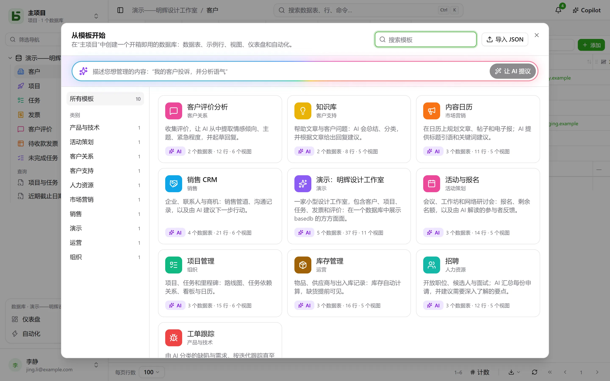

**模板**只需点击一下即可创建一个完整的数据库：它的数据表及其关联、示例行、视图、一个仪表盘、若干自动化，以及由 AI 自动填写的字段。[模板库](/basedb/zh-cn/modeles/)展示了 basedb 提供的模板。

## 从模板开始

点击**新建数据库**，然后选择**从模板开始，或让 AI 生成**：模板库随即打开。



每个模板在使用前都可以完整查看——它的数据表及字段、视图、自动化，以及每个 AI 字段的指令。**创建数据库**会要求填写显示名称；如果包含 AI 字段，还会征求您的同意，允许将这些字段引用的值发送给实例的 AI 服务商。如不同意，它们就是普通字段，填入其示例值。

**加载示例数据**默认勾选，会用示例行填充各数据表，方便您看到数据库运行起来的样子。取消勾选后，数据表保持为空，可直接填入您自己的数据——视图、仪表盘和自动化仍会照常创建。

空项目中还会提供**演示数据库**：一家小型代理公司，包括它的客户、项目、任务、发票和评价，展示了 basedb 的方方面面。

## 在您的语言中

官方模板都以**屏幕所用的语言**读取和创建：数据表、字段、选项、示例行、视图、仪表盘、自动化以及 AI 指令皆是如此。示例行也会随语言换一个世界：法语版里昂的“Boulangerie Martin”面包店，到了中文版变成了成都的“陈记面包坊”。

导入到您实例中的模板，或从某个数据库保存而来的模板，都是由某个人编写的：它会按编写时的样子原样显示。

## 让 AI 生成

在模板库顶部，用一句话描述您的需求——“跟踪客户投诉，并分析语气”。AI 会提议一个完整的数据库：数据表、逼真的示例行、视图、仪表盘，以及在适用时添加的 AI 字段。您可以像查看模板一样查看它，也可以**细化**它（“添加一张供应商数据表”），然后再创建。AI 只会收到您的这句话——不包含任何数据库中的任何数据——在您点击之前也不会创建任何内容。

## 用 JSON 编写模板

模板是一个 JSON 文档。以下是它的骨架：

```json
{
  "format": 1,
  "key": "suivi-tickets",
  "label": "Suivi de tickets",
  "summary": "Une phrase pour la galerie.",
  "category": "Produit et technique",
  "icon": "bug",
  "color": "#ef4444",
  "tables": [
    {
      "key": "tickets",
      "label": "Tickets",
      "fields": [
        { "label": "Titre", "kind": "short_text" },
        { "label": "Statut", "kind": "select", "options": ["Nouveau", "En cours", "Résolu"] },
        { "label": "Ouvert le", "kind": "date" },
        { "label": "Description", "kind": "long_text" },
        { "label": "Catégorie", "kind": "select", "options": ["Bug", "Demande"],
          "ai": { "prompt": "Classe ce ticket : {{Titre}} — {{Description}}" } },
        { "label": "Âge (jours)", "kind": "formula", "formula": "JOURS(AUJOURDHUI(); [Ouvert le])" }
      ]
    },
    { "key": "produits", "label": "Produits", "fields": [{ "label": "Nom", "kind": "short_text" }] }
  ],
  "links": [{ "from": "tickets", "label": "Produit", "to": "produits" }],
  "rows": {
    "produits": [{ "$key": "app", "Nom": "Application mobile" }],
    "tickets": [{ "Titre": "Crash au démarrage", "Statut": "En cours", "Ouvert le": "-3d", "Produit": "@app" }]
  },
  "views": [
    { "table": "tickets", "label": "Tableau", "kind": "kanban", "spec": { "group_by": "Statut" } }
  ],
  "dashboards": [
    { "label": "Vue d’ensemble", "blocks": [
      { "kind": "number", "title": "Ouverts", "table": "tickets", "filter": "[Statut] ne \"Résolu\"" },
      { "kind": "chart", "title": "Par catégorie", "table": "tickets", "group_by": "Catégorie", "style": "pie" }
    ] }
  ],
  "automations": []
}
```

基本规则：

- **一切都按显示名称引用**：视图中的字段、筛选条件（`[Statut] ne "Résolu"`）、公式（`[Prix] * [Quantité]`）、AI 指令或消息（`{{Titre}}`）。选项也按其显示名称给出。
- 数据表的**第一个字段**就是其显示字段：可以是文本、数字、日期、电子邮件或网址。
- **关联**在 `links` 中声明，绝不作为字段声明；某一行通过 `"@clé"` 引用另一行，即目标数据表中某一行的 `$key`。
- **日期**可以相对于应用模板的当天：`"today"`、`"+3d"`、`"-2w"`、`"+1m"`；日期时间则再加上时刻，如 `"+1d 14:30"`。人员写作 `"$moi"`。
- **AI 字段**带有 `"ai": { "prompt": "…" }`，并可设置示例值，该值仅在不使用 AI 时写入。
- 模板**绝不**包含共享、权限、Webhook、文件或除 `"$moi"` 以外的人员：模板有时来自外部，不应开放任何访问。

完整参考——所有字段类型、所有视图键、各项上限——见仓库中架构文档的第 20 章。

## 向所有实例发布模板

官方模板库中的模板就是仓库中 [`packages/templates/catalog`](https://github.com/eodia/basedb/tree/main/packages/templates/catalog) 目录下的文件，每个模板一个文件，以其 `key` 命名。公开网站会据此生成[模板库](/basedb/zh-cn/modeles/)，并在 [`/basedb/modeles/catalogue.json`](/basedb/modeles/catalogue.json) 发布完整的模板目录。每个实例会在有人打开模板库时读取该目录，并缓存一小时：修改文件并重新发布网站，就足以更新所有实例的模板库。

每个模板都会在网站构建时，由与服务器相同的校验器进行校验：无效的模板会让构建失败，而不会到达用户手中。

官方模板只用法语写一次。它在其他语言中的文本是一份词典，
[`packages/templates/i18n/<langue>/<clé>.json`](https://github.com/eodia/basedb/tree/main/packages/templates/i18n)
——法语原文及其译文——由网站与模板目录一起发布（`/basedb/modeles/i18n/<langue>.json`）。实例会据此替换每一段文本，并在其被引用的地方——公式、筛选条件、视图、指令——同步更新，然后重新校验结果：会破坏模板的词典不会被使用，此时提供的是法语原版模板。词典中缺失的文本则保留法语原文。

实例从 `BASEDB_TEMPLATES_URL` 地址读取模板目录——默认是公开网站的地址。您可以将其指向自己的模板目录，或设为 `off` 以不读取任何目录：此时实例使用其版本内置的模板。

## 您实例中的模板

管理员可以在模板库中（“导入 JSON”）将 **JSON 模板导入**自己的实例：它会加入所有用户的模板库，并替换键相同的模板。AI 的提议也可以一键加入其中。

任何数据库也都可以变成模板：在数据库菜单的**更多操作**下选择**另存为模板**。它的数据表、字段、AI 指令、关联、共享视图、仪表盘和自动化——如果您愿意，还可包括每张数据表最多 50 行数据——会下载为 JSON，可直接加入官方模板目录或实例的模板目录。查找行、使用分支或引用前序步骤的自动化暂时不包含在内，界面会对此加以说明。
