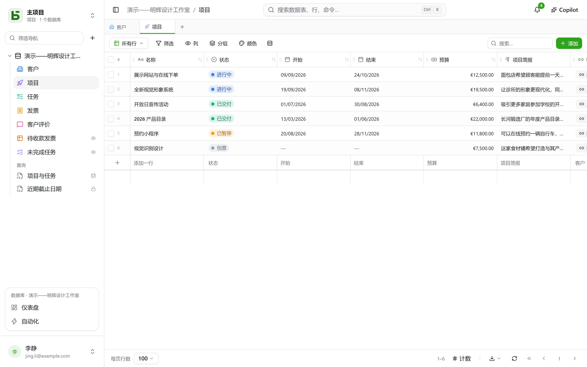
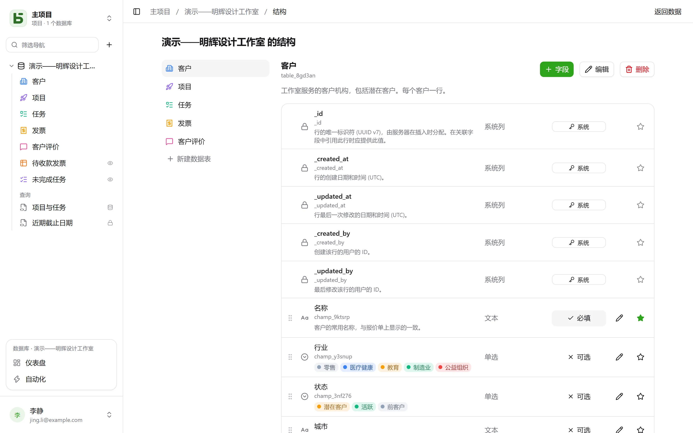

basedb 中的每张数据表都是一张 PostgreSQL 数据表；每个字段都是一个有类型的列。您输入的显示名称（“Échéance”）会通过稳定的 **slug 化**规则变成可读的物理名称（`echeance`）：去掉重音符号、转为小写、避开保留字。

## 类型

| 类型 | PostgreSQL 列 | 说明 |
|---|---|---|
| 短文本 | `text` | 单行 |
| 长文本 | `text` | Markdown：网格中显示摘要，悬停时显示渲染效果，另有专用编辑器；可以[引用列](#富文本与变量) |
| 富文本 | `text` + `CHECK` | 写入时经过净化的 HTML，在可视化编辑器中编写——[见下文](#富文本与变量) |
| 数字 | `numeric` | 从不使用浮点数：金额不会产生误差 |
| 货币、百分比、时长、评分 | `numeric` | 一个数字及其[显示格式](#显示格式)：`12,50 €`、`15 %`、`1:30`、★★★★☆ |
| 复选框 | `boolean` | |
| 日期 | `date` | |
| 日期和时间 | `timestamptz` | 一个绝对时间点，按读者所在的时区显示 |
| 单选 | `text` + `CHECK` | 每个选项可设颜色、图标或图片 |
| 多选 | `text[]` + `CHECK` | 可用数组运算符筛选 |
| 电子邮件 | `text` + `CHECK` | 由数据库校验的地址，点击即可打开 |
| 电话、条形码、地址 | `text` | 短文本加上相应格式：拨号链接、等宽字体、指向地图的链接 |
| 链接 | `text` + `CHECK` | 输入时自动补全（`exemple.fr` → `https://exemple.fr`） |
| 人员 | `uuid` | 工作区中的一名成员；指定某人时会[通知](/basedb/zh-cn/fonctionnalites/collaboration/)对方 |
| 自动编号 | `bigint` 标识列 | 已有的行也会被编号；无需任何人输入 |
| 关联 | `uuid` + `FOREIGN KEY` | 指向目标数据表的真正外键 |
| 多项关联 | `uuid[]` | 关联多行，其完整性由触发器维护 |
| 公式 | `STORED` 生成列 | 由 PostgreSQL 计算——或在读取时计算，参见[公式](#公式) |
| 查找引用、汇总、计数 | 无 | 通过关联在读取时计算 |
| 按钮 | 无 | 打开一个地址或运行一个[自动化](/basedb/zh-cn/fonctionnalites/automatisations/) |
| 文件、图片 | `jsonb`（元数据） | 文件内容存放在[文件存储](/basedb/zh-cn/fonctionnalites/fichiers/)中 |

每张数据表还带有**系统列**：`_id`（UUID v7）、`_created_at`、`_updated_at`、`_created_by`、`_updated_by`——由触发器维护，永远无法通过 API 写入。网格将它们放在列菜单中的**系统信息**下：每张数据表都有这些列，但很少用得上。



## 由数据库保证的约束

界面所承诺的，由 PostgreSQL 来保证。单选字段是一个 `CHECK` 约束；关联是一个 `FOREIGN KEY`；链接或电子邮件地址则是一个正则表达式。违反这些约束的直接 SQL 写入会被拒绝，与在界面中一样：

```text
Check constraints:
  "ck_opportunites__statut__enum" CHECK (statut = ANY (ARRAY['nouveau', 'qualifie', …]))
Foreign-key constraints:
  "fk_opportunites__clients_id" FOREIGN KEY (clients_id) REFERENCES b_t4z56fq_ventes.clients(_id)
```

## 显示格式

货币、百分比、时长、评分、电话、条形码和地址可以像类型一样选择，但它们其实是**格式**：列本身仍是数字或文本，改变的只是显示方式。

| 格式 | 适用于 | 显示与输入 |
|---|---|---|
| 货币 | 数字 | `12 500,00 €`——欧元、美元、英镑、瑞士法郎、加元、日元 |
| 百分比 | 数字 | `15 %` |
| 时长 | 秒数 | `1:30`，可输入 `1h30`、`90 min` |
| 评分 | 数字 | 1 到 10 颗星，点击即可设置 |
| 电话 | 短文本 | 拨号链接 |
| 条形码 | 短文本 | 等宽字体 |
| 地址 | 短文本 | 指向地图的链接；在行详情中，**查找地址**会给出匹配的完整地址；[地图](/basedb/zh-cn/fonctionnalites/vues/#地图)视图会依据它定位该行 |

格式可以事后更改（在字段编辑中的**显示**），不会影响已保存的值。格式不限制取值：5 星制中的 7 分仍然是 7。

## 默认值

在字段的修改界面中，**默认值**决定了新建时未填写该字段的行会取什么值：

| 选项 | 适用于 | 新建的行会得到 |
|---|---|---|
| 固定值 | 大多数类型 | 所选的值——如状态"新建"、优先级 3 |
| 今天的日期 | 日期 | 创建当天的日期，按该人所在的时区计算 |
| 创建时刻 | 日期和时间 | 精确的创建时间 |
| 创建该行的人 | 人员 | 创建这一行的人——如"负责人：我" |

新建行的行详情和表单打开时都已预先填好该值；清空字段则让它保持为空。默认值适用于任何创建方式——界面、API、MCP、导入、共享表单、自动化——即便该字段是这个人无法修改的：这是数据表本身的规则。已有的行不会改变，直接用 SQL 插入的行也不会获得默认值：这是 basedb 施加的，而不是列本身的行为。

## 公式

公式用英语书写（法语函数名同样可用），字段放在方括号中，参数之间用 `,` 分隔：

```text
ROUND([Montant HT] * (1 + [Taux de TVA]), 2)
IF([Payée], FALSE, DAYS(TODAY(), [Échéance]) > 0)
DAYS([Fin], [Début])
```

编辑器会提示可插入的字段，并提供函数面板；出错时会指明有问题的字段或字符。

| 类别 | 函数 |
|---|---|
| 逻辑 | `IF`、`IFBLANK`、`ISBLANK`、`AND`、`OR`、`NOT`、`TRUE`、`FALSE` |
| 数字 | `ROUND`、`ABS`、`CEILING`、`FLOOR`、`MIN`、`MAX` |
| 文本 | `UPPER`、`LOWER`、`TRIM`、`LEFT`、`RIGHT`、`LEN`、`TEXT`、`VALUE` |
| 日期 | `YEAR`、`MONTH`、`DAY`、`WEEKDAY`、`DAYS`、`ADD_DAYS`、`DATE`、`TODAY`、`NOW` |
| 运算符 | `+ - * /`、用于连接文本的 `&`、`= <> < <= > >=` |

公式会成为 PostgreSQL 的**生成列**：`psql` 和您的工具可以像读取其他列一样读取它。依赖当天日期（`TODAY()`、`NOW()`）或引用了查找引用、汇总的公式会**在读取时计算**：在 basedb 中可以对其筛选和排序，但在直接 SQL 中并不存在。

公式不能引用其他公式，也不能直接引用关联——这由查找引用来完成。提取或替换文本中的一部分将在后续版本中提供。

## 查找引用、汇总与计数

有三种字段可以**通过关联**读取数据，方向不限——既可以是“项目的客户”，也可以是“通过 Projet 关联的任务”：

- **查找引用**取回关联行中的一个值或值列表：项目所属客户的城市；
- **汇总**对关联行进行计算：值的个数、总和、平均值、最小值、最大值——某客户的营业额、其评价的平均评分；
- **计数**统计关联行的数量：某项目的任务数。

它们在每次读取时计算，**使用读取者的权限**：如果关联的数据表对您不开放，该字段也同样不开放。它们可以筛选和排序。它们只沿一个关联读取，不可写入，没有对应的列——因此在直接 SQL 中不存在——也不会出现在导入、表单或历史记录中。

## 关联

**关联**将一行与同一数据库中另一张数据表的一行连接起来。网格显示目标行的**显示值**——即您在其数据表中指定为显示字段的那一列——筛选条件也可以穿过关联（`clients_id.ville eq "Lyon"`）。指向某一行的所有行会显示在该行的行详情中。

勾选**每条记录关联多行**，关联就变为**多项关联**：一个任务依赖多个任务，一篇文章属于多个类别。关联的行以标签形式显示，通过搜索选择，并可在行详情中点击打开。删除一个目标行时，它会从引用它的列表中移除——如果您做了相应设置，删除则会被拒绝。可以使用 `has_any`、`has_all` 和 `is_null` 筛选，它们同样可以穿过关联（`taches_ids.titre contains "logo"`）。多项关联暂不支持排序、分组和导入。

## 按钮

**按钮**字段没有值：它负责执行操作。它可以**打开一个地址**——`https://` 或 `mailto:`，并可引用该行（`mailto:{{E-mail}}`）——或者**运行一个自动化**，该自动化须由同一数据表上的按钮触发。按钮显示在单元格、卡片和行详情中。

## 描述

数据库、数据表和字段都可以带有**描述**，修改时无需迁移。描述会被复制到 `psql` 读取的 `COMMENT ON`、自动生成的文档，以及智能体通过 `describe_table` 读取的内容中。

## 富文本与变量

**富文本**是长文本的 HTML 版本，在创建字段时选择（“富文本 (HTML)”）：标题、粗体、斜体、下划线、删除线、列表、引用、代码、链接和分隔线，均在可视化编辑器中完成。无论来自界面、API、MCP 服务器还是导入，HTML 都会**在写入时净化**；此外，`CHECK` 约束还会拒绝直接用 SQL 写入的危险内容（`<script>`、`on…` 属性、`javascript:`）。不支持图片、表格和颜色：数据库不会保留的内容，编辑器也不提供。

长文本——无论普通文本还是富文本——都可以**引用所在行的某一列**。编辑器的**列**菜单会在光标处插入引用：在富文本中显示为一个标签，在 Markdown 中则是 `{{Ville}}`。

> 预计于 `{{Livraison}}` 送达 `{{Ville}}`。

- 列中保存的是引用的原样——`{{ville}}`，使用物理名称：这正是 `psql` 读到的内容。
- 在其他所有地方——网格、行详情、API、MCP 服务器、共享视图、自动化——文本都**代入该行的值**显示：“预计于 02/10/2026 送达 Lyon。”修改城市，文本也随之改变。
- 单选按其显示名称显示，人员按其姓名显示，日期按您设置的格式显示；插入富文本中的值永远不会被当作标记。
- 读者无权读取的列不会显示任何内容：既不显示其值，也不显示其名称。

富文本不能由 AI 填写：模型写出的是文本，而不是经过净化的 HTML。

## 修改结构

数据库的**结构**界面——位于侧边栏中该数据库的 **⋯** 菜单里——列出数据表及其字段：添加、重命名、设为必填、调整顺序、添加描述、指定显示字段。



修改结构需要**可管理**级别。没有该级别时，界面只能查看，不提供任何操作：没有按钮、没有铅笔图标、没有拖动手柄——必填和显示字段只作说明，不可更改。无论如何，服务器都会拒绝每一项修改；界面也不再假装接受。

添加、重命名字段或更改其类型都通过**迁移引擎**完成：分步执行的计划、短暂的锁，以及在数据无法转换时说明原因的拒绝。

**重命名**数据库、数据表或字段都在同一个对话框中完成。显示名称总是会改变，无需迁移。管理员还会在下方看到“同时在数据库中重命名：`clients` → `comptes`”：勾选后，物理名称也会改变，并显示影响分析——列出引用旧名称的查询、SQL 视图和自动化。旧名称会由一个**兼容别名**（一个视图）继续提供，让您有时间更新查询。

删除不会立即清除任何内容：数据表或数据库会被移到一旁（重命名为 `zz_supprime_…`），仍可通过 SQL 读取。已删除的数据库可以恢复；在界面中单独恢复一张数据表的功能[即将推出](/basedb/zh-cn/feuille-de-route/)。永久**清除**仅限在管理后台中操作，须在三十天后进行，并会先执行一次经过校验的 CSV 导出。
