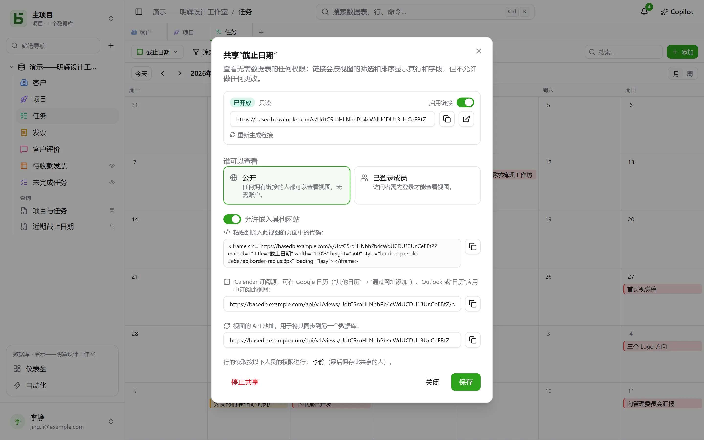
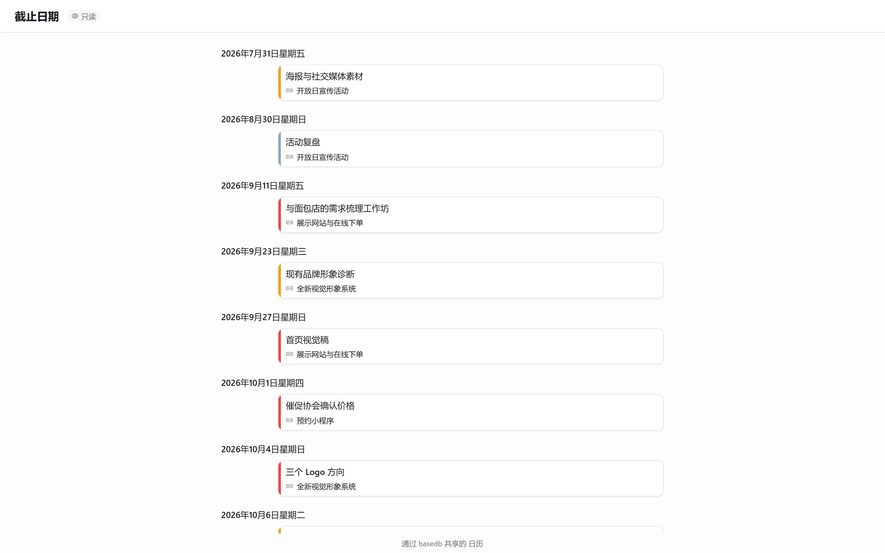

数据视图——网格、看板、日历、时间线、画廊、列表——可以**以只读方式共享**：`/v/<jeton>` 链接向无法打开 basedb 的人展示该视图，且不允许写入任何内容。它与[共享表单](/basedb/zh-cn/fonctionnalites/formulaires-partages/)相对应：共享表单允许回复，但不允许读取任何内容。[仪表盘](/basedb/zh-cn/fonctionnalites/tableaux-de-bord/#共享仪表盘)也以同样的方式共享。

## 共享

视图菜单 → **共享…**，然后选择：

| 访问方式 | 谁可以查看 |
|---|---|
| **公开** | 任何持有链接的人，无需账户 |
| **已登录成员** | 工作区成员，登录后查看——如有需要，可仅限特定用户组 |

**启用链接**开关可暂停链接而不丢失它。页面在应用之外打开：没有侧边栏，没有数据库名称，也没有数据表名称——只有视图、它的筛选条件和列，别无其他。日历或时间线在其中就像日程表一样呈现。

## 以谁的身份读取

视图以**发布者的权限**读取，并在每次读取时重新判定：对发布者隐藏的字段不会显示；如果发布者失去了对数据表的访问权限，链接将不再显示任何内容。

## 嵌入其他网站

勾选**允许嵌入其他网站**：对话框会提供一段 `<iframe>` **嵌入代码**，可粘贴到内网、Wiki 或企业官网中。未勾选此项时，页面会拒绝在其他网站的框架中显示。

## 在日历应用中订阅日历

对于以**公开**方式共享的日历或时间线，对话框会提供**日历订阅地址**：一个 iCalendar 订阅源（`…/calendar.ics`，最多 1000 个事件），可在 Google 日历、Outlook 或 Apple Calendar 中订阅。团队的截止日期会出现在每个人的日历应用中，并随数据表同步更新。

## 作为其他数据库的数据源

公开链接还会提供**视图的 API 地址**：以 JSON 格式返回该视图显示的行。[同步数据表](/basedb/zh-cn/integrations/synchronisation/)——无论在本实例还是其他实例上——都可以将其作为数据源。

## 限制

- 读取限制为每个地址、每个链接每分钟 120 次请求。
- 表单不能以只读方式共享：它的共享是[为了收集回复](/basedb/zh-cn/fonctionnalites/formulaires-partages/)。
