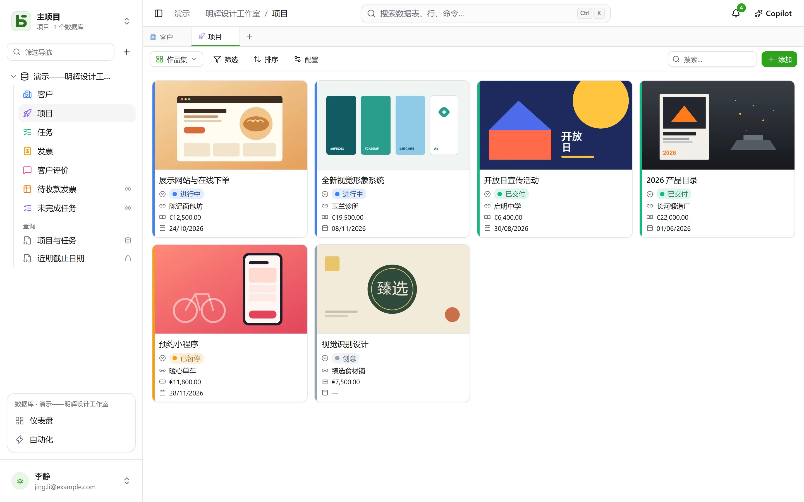
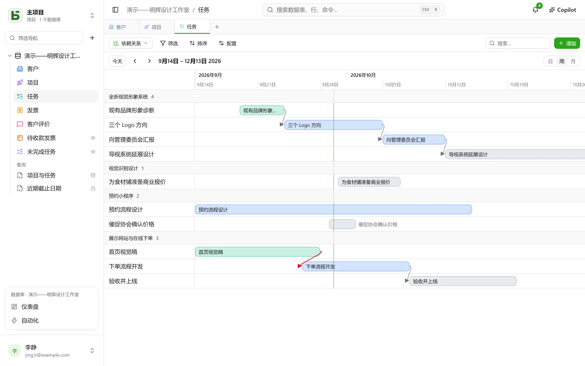
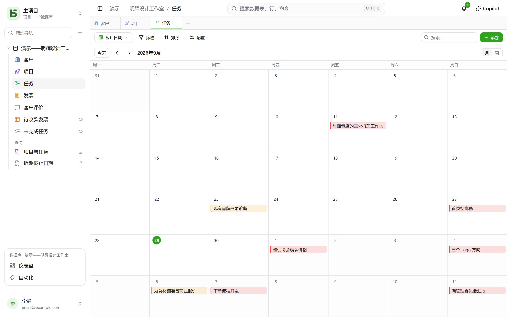
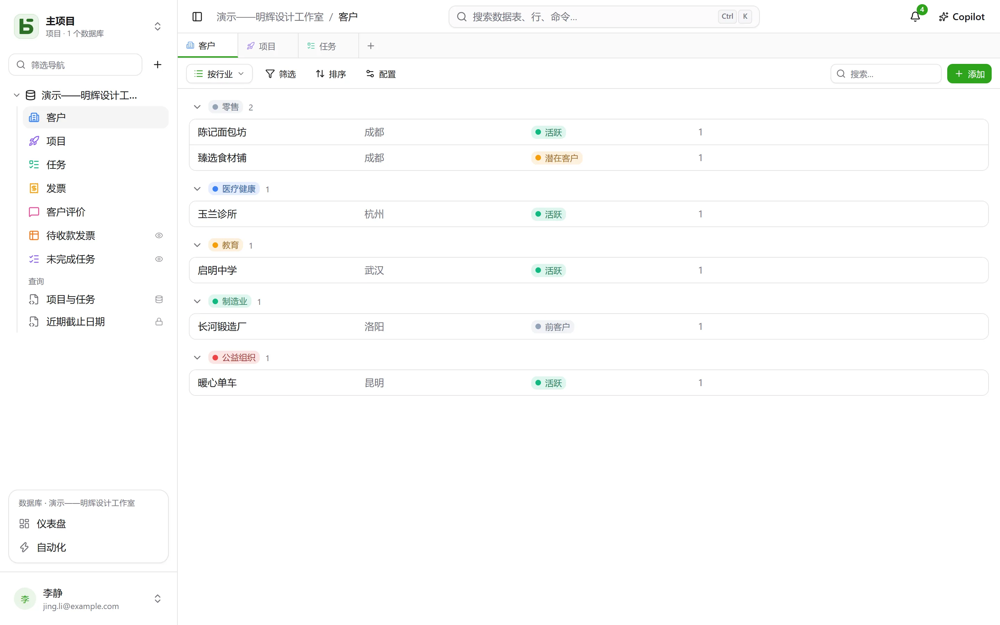

一张数据表可以用**十种方式**呈现。视图不复制任何数据，也不会赋予比数据表本身更多的权限。

:::note
这些视图是呈现**一张**数据表的方式。[SQL 视图](/basedb/zh-cn/fonctionnalites/requetes-et-vues-sql/)则是另一回事：它是一个真正的 PostgreSQL 视图，基于数据库中的数据表用 SQL 编写，在侧边栏中与数据表并列。
:::

| 视图 | 显示内容 | 所需条件 |
|---|---|---|
| **网格** | 经过筛选、排序、分组的行，列可自选 | — |
| **看板** | 分列排布的卡片 | 一个单选字段 |
| **日历** | 按日期排布的行，按月或按周显示 | 一个日期字段 |
| **时间线** | 两个日期之间的条形及其依赖关系 | 一个开始日期 |
| **画廊** | 带封面图片的卡片 | — |
| **列表** | 每条记录一行，分组可折叠 | — |
| **地图** | 每一行都被放置在地图上的对应位置 | 一个地址，或一对经纬度 |
| **表单** | 用于创建一行的问题页面 | — |
| **问卷** | 同样的问题，每屏一个 | — |
| **测验** | 计分的问题，每屏一个，最后显示分数 | — |

## 视图选择器

它位于”筛选”左侧。”所有行”是数据表的网格，没有人保存过它，也没有人能删除它；其后是**协作视图**，按数据库构建者设定的顺序排列，最后是**我的视图**。底部的**创建视图**把十种视图分成两类：**查看行**和**收集回复**（表单、问卷、测验）。

- **协作视图**对所有人可见。创建、配置、重命名、调整顺序或删除协作视图需要**可管理**级别。它可以被**锁定**：此时会显示一个锁形图标，在解锁之前任何人都无法修改它。
- **个人视图**只有您自己可见，只需拥有读取该数据表的权限。点击**创建个人视图**，或在筛选和排序后点击**另存为视图**：每个人都可以保存自己的查看方式，而不影响其他人。**复制**一个协作视图会得到它的个人副本。

## 工具栏

位于网格上方，依次为：

- **筛选**：按字段组合多个条件；
- **列**：选择要显示的内容——系统列单独放在“系统信息”下；
- **分组**：按单值字段（单选、关联、人员、日期、数字、文本、复选框等）将行分成可折叠的组，每组显示其在整个筛选结果中的计数；
- **颜色**：按单选字段为行着色，或按**规则**着色——每条规则由一个筛选条件和一种颜色组成，最多二十条——显示为色条、背景或两者兼有；
- **行高**：矮、中、高、特高；
- 右侧的**搜索…**：在您输入时搜索所有列；按 Esc 清空搜索。它同样适用于看板、日历、时间线、画廊和列表，并且永远不会保存到视图中。

每列下方都有一个**统计**，基于筛选结果中的所有行计算，而不仅仅是当前页：已填、空白、唯一值、总和、平均值、最小值、最大值、已勾选数。

## 看板、日历、时间线

- **看板**按单选字段排布卡片；拖动卡片即可修改该行，列顶部的“+”会创建一个已带有该选项的行。每张卡片显示标题、封面图片、所选字段，以及一段引用该行数值的**描述**——“预计于 `{{Date}}` 交付给 `{{Client}}`”——在视图设置中通过**插入字段**按钮编写。
- **日历**将每一行放在其日期上，可带结束日期；将一行从一天拖到另一天即可调整日期。
- **时间线**在开始日期和结束日期之间绘制条形，按单选字段或关联分组。使用**依赖于**设置（一个指向数据表自身的关联），每个任务都会用箭头连接到它所依赖的任务；当时间顺序颠倒时，箭头显示为红色。

## 画廊与列表

- **画廊**显示卡片：一张**封面图片**（裁剪或完整显示）、一种尺寸（小、中、大卡片），以及按单选字段设置的颜色。
- **列表**每条记录显示一行，按单选字段、关联或人员**分组**。

在看板、画廊和列表中，卡片和行可以通过拖动**手动排序**——最多 5000 条；一旦选择了排序规则，就以排序规则为准。

## 地图

**地图**根据以下信息把每一行放在对应的位置：

- 一个**地址**——一段短文本，最好使用**地址**格式（参见
  [数据表和字段](/basedb/zh-cn/fonctionnalites/tables-et-champs/)）："12 rue des Lilas, Lyon"；
- 或一对**纬度**和**经度**，两个数字字段，按原样使用。

一个图钉的**颜色**来自一个单选字段，悬停时显示该行的**标题**，点击则打开其行详情。地图会跟随视图的筛选条件和排序，最多显示 2000 行。

地址由实例的地理编码服务**一次性定位**——默认为 OpenStreetMap 的服务——按它所限定的速率进行：在一张新地图上，图钉会随着结果陆续出现，大约每秒一个，此后再打开就会立即显示。一个提示会统计已定位的行数、仍待定位的地址，以及无法定位的地址：找不到的地址需要补充信息（城市、邮编），绝不会被悄悄忽略。

:::note[会离开您服务器的内容]
地址文本会发送给地理编码服务，每位读者的浏览器也会从切片服务器直接加载底图。实例的运维人员可以选择其他服务，或者完全不使用：参见
[环境变量](/basedb/zh-cn/hebergement/variables/#地图和地址)。
:::

## 表单与问卷

勾选问题并调整顺序；每个问题都有标题、帮助说明、示例答案，并可设为必填。表单有自己的标题、介绍、按钮文字和感谢语。它可以在 basedb 中填写，也可以[通过链接共享](/basedb/zh-cn/fonctionnalites/formulaires-partages/)。

无需任何设置即可开始使用：新建的表单只询问填写者要回答的内容——而不是状态、指派人或团队随后填写的关联字段，除非它们是必填的——表单会采用其所属数据表的颜色和浅色主题，每个空字段都会显示一个合适的示例。其余一切都可以随时更改：

- **外观**：八种主题——浅色、柔和、黎明、海洋、森林、夜色、纸张、极简——一种强调色、一种字体、左对齐或居中对齐；
- **预先填入今天的日期**：日期问题会预先填好今天的日期（日期时间问题还会填好当前时间），填写者可以保留或修改；
- **添加显示条件…**：只有当之前的某个回答需要时，问题才会被提出（“情绪为负面”“评分不超过 2”）。被隐藏的问题既不是必填项，也不会被提交；
- **更多选项**：开始和提交按钮、题号、进度条、自动跳转到下一题、结束语和一个结束按钮（“返回网站”）、彩带特效。

**问卷**占据整个屏幕：先是一个说明所需时间的欢迎页，然后每次滑入一个问题。所有操作也都可以用键盘完成：按 **Enter** 继续，字母 **A**、**B**、**C**……用于选择，**Y** 或 **N** 用于是否题，数字用于评分——单选题会在选定后自动跳转到下一题。提交时会有庆祝效果：一个绘制出来的对勾，以及表单配色的彩带。

## 测验

测验是一种会计分的问卷。在每个问题下方，设置它的**正确答案**及其分值——不填则默认为 **1 分**，最高可到 100：

| 问题 | 正确答案 |
|---|---|
| 单选 | 一个选项 |
| 多选 | 需要勾选的所有选项，且仅限这些选项 |
| 复选框 | 是或否 |
| 数字、评分 | 一个数字 |
| 日期 | 一个日期 |
| 短文本、电子邮件、URL | 用 `;` 分隔的一个或多个可接受答案——不区分大小写和重音符号 |

没有正确答案的问题——如姓名、留言——会被提出但不计分。至少需要一个计分问题才能创建测验。

其余设置在**评分**部分完成：

- **公布答案**：**每道题之后**——答案立即得到核对，正确显示为绿色，错误则显示为红色并给出正确答案，屏幕顶部的分数随之增加——，**最后**——先显示分数，再公布答案——，或**从不**——只显示分数，正确答案始终保密；
- **及格线**：占总分的百分比；结束页面据此显示"及格了！"或"这次未能通过…"；
- **得分保存至**：数据表中的一个数字字段，用于记录每份回复的分数。按它对网格排序，就是排行榜。名为"分数""得分"或"积分"的字段会被自动选中。

结束页面用一个逐渐填满的圆环显示分数和百分比，随后，除非设置为"从不"，还会显示每道计分题目的作答与正确答案。被前面某个回答隐藏的问题不计入总分。

:::note
在应用内，能读取该视图的人也能读取正确答案。通过[共享链接](/basedb/zh-cn/fonctionnalites/formulaires-partages/#共享测验)，正确答案永远不会离开服务器：由服务器负责评分和计分。
:::

## 共享视图

数据视图——网格、看板、日历、时间线、画廊、列表——可以通过链接**以只读方式共享**，也可以嵌入其他网站，日历还可以成为日历订阅源。参见[共享视图](/basedb/zh-cn/fonctionnalites/vues-partagees/)。

## 读者看不到的内容

视图会**针对每位读者重新投影**：对其隐藏的字段会从列、卡片和问题中消失。如果视图的筛选条件引用了隐藏字段，则整个视图都不会显示：若去掉筛选条件显示，它展示的内容就会超出其本来的用途。
