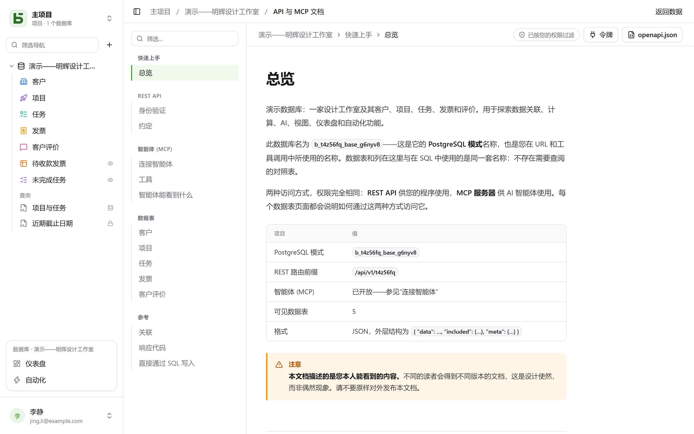

REST API 与界面使用的 API 完全相同：**不存在私有路由**。它的 URL 使用物理名称——也就是您在 SQL 中读到的名称。

```text
/api/v1/<tenant>/data/<base>/<table>
/api/v1/t4z56fq/data/b_t4z56fq_ventes/opportunites
```

## 令牌

在界面中，打开数据库的 **⋯** 菜单 → **API 与智能体** → **API 和 MCP 令牌…**：拥有该数据库或其项目**可管理**级别的人，在确认密码后，即可在这里创建一个仅限于该数据库（其所有环境，或仅一个环境）的**集成令牌**，默认只读——没有密码、通过身份提供商登录的账户，暂时还不能这样做。令牌只显示一次；请将其保存在环境变量中。

令牌可以读取；如果创建时授予了写入权限，还可以创建和修改；如果**专门为删除而创建**——权限为“读写和删除”——还可以删除，但不能删除会因级联关联而牵连其他行的那一行。它的权限永远不会超过创建它的人。

```bash
export BASEDB_TOKEN=bdb_…
curl "http://localhost:3000/api/v1/t4z56fq/data/b_t4z56fq_ventes/opportunites?limit=20" \
  -H "Authorization: Bearer $BASEDB_TOKEN"
```

## 选择环境

如果数据库有多个[环境](/basedb/zh-cn/fonctionnalites/environnements/)——生产、预发布……——那么对于为整个数据库创建的令牌，它仍然只是**一个**数据库。路径以生产环境的名称指明数据库，请求头 `X-Basedb-Environment` 则用于选择环境：

```bash
curl "http://localhost:3000/api/v1/t4z56fq/data/b_t4z56fq_ventes/opportunites" \
  -H "Authorization: Bearer $BASEDB_TOKEN" \
  -H "X-Basedb-Environment: recette"
```

- 不带该请求头时，使用路径所指明的环境：`b_t4z56fq_ventes` 是生产环境，`b_t4z56fq_ventes_recette` 是预发布环境——两种写法都有效。
- 对于不发送请求头的客户端，`?environment=recette` 的作用相同。
- 环境以其徽标上的名称指定，不区分大小写和重音符号，也可以用 `production`。数据库中不存在的环境会返回 `404`，与任何不存在的资源一样。
- `GET /api/v1/<tenant>/meta/bases` 会列出每个环境及其 `environment` 块（`label`、`production`）；带上请求头时，只列出那一个环境。

创建时被限定为单个环境的令牌，不会打开其他任何环境：请求头对它没有影响。它的权限始终会逐个环境地与创建它的人的权限取交集。

## 读取

| 参数 | 作用 |
|---|---|
| `filter` | 一个易读的表达式：`statut eq "gagne" and montant gte 10000` |
| `sort` | `-montant,nom` |
| `fields` | 要返回的列 |
| `limit`、`after` | 使用加密游标分页：把某一页的 `meta.next_cursor` 传给 `after`，即可得到下一页（`meta.has_next_page`） |
| `links=display` | 返回关联及其显示值 |
| `count=exact` | 返回总数，上限为 100000 |
| `variables=raw` | 按原样返回长文本，包括 `{{colonne}}`，而不是代入[该行的值](/basedb/zh-cn/fonctionnalites/tables-et-champs/#富文本与变量) |

运算符：`eq`、`ne`、`eq_ci`、`contains`、`starts_with`、`ends_with`、`in`、`is_null`、`gt`、`gte`、`lt`、`lte`、`between`，可用 `and`、`or`、`not` 和括号组合。筛选条件可以穿过关联：`clients_id.ville eq "Lyon"`。

## 写入

```bash
curl -X POST "http://localhost:3000/api/v1/t4z56fq/data/b_t4z56fq_ventes/opportunites" \
  -H "Authorization: Bearer $BASEDB_TOKEN" -H "content-type: application/json" \
  -d '{"values": {"nom": "Audit RGPD", "statut": "nouveau", "montant": 12000}}'
```

`PATCH …/<table>/<_id>` 使用相同的请求体 `{"values": {…}}` 修改一行。错误采用统一格式：`{ "code": "…", "details": {…}, "request_id": "…" }`，每种原因对应一个稳定的错误代码。

每次写入都会返回 `x-basedb-transaction` 响应头：将其传给 `POST /api/v1/<tenant>/history/undo`（`{"transaction": "…"}`）即可撤销该写入，与界面中的 Ctrl+Z 一样——如果该行此后已被修改，撤销会被拒绝。

## 行之外

使用同一个令牌：

| 路由 | 作用 |
|---|---|
| `GET …/data/<base>/<table>/aggregate` | 对筛选结果中所有行进行统计：`aggregates=montant:sum,nom:filled`、`group=statut` |
| `GET …/data/<base>/<table>/<_id>/comments`、`POST` | 读取和写入某一行的评论 |
| `POST /api/v1/<tenant>/automations/<id>/run` | 在某一行上（`{"record": "…"}`）运行由按钮触发的自动化 |
| `GET /api/v1/<tenant>/meta/bases/<base>/dashboards` | 数据库的仪表盘 |
| `GET /api/v1/<tenant>/meta/users` | 工作区成员，用于人员字段 |
| `GET /api/v1/<tenant>/meta/templates` | 模板库中的数据库模板 |
| `GET /api/v1/<tenant>/events?base=<base>&table=<table>` | 实时跟踪一张数据表：得到的是信号，随后通过上面的路由重新读取（参见[Webhook](/basedb/zh-cn/integrations/webhooks/#不用-webhook跟踪一张数据表)） |

[共享视图](/basedb/zh-cn/fonctionnalites/vues-partagees/)无需账户即可读取：`GET /api/v1/views/<jeton>` 和 `…/rows` 返回 JSON，`…/calendar.ics` 返回 iCalendar。

构建类操作——创建自动化、仪表盘、集成——仍仅限于界面会话：令牌只能读写行，不能修改数据库本身。

## 颜色和图标

数据表以及单选字段的每个选项，都有一个颜色（`color`，`#rrggbb`）和一个图标（`icon`，即界面所绘制的 [Lucide](https://lucide.dev/icons/) 图标名称：`truck`、`circle-check`、`flame`……）。`GET …/meta/bases/<base>` 会返回数据库、其数据表以及各字段选项的颜色和图标。

要设置它们，请使用能够修改结构的人的访问令牌（`POST /auth/session/access`）——集成令牌无法修改数据库本身：

| 路由 | 请求体 |
|---|---|
| `POST …/admin/bases/<base>/tables` | `{"label": "Tickets", "color": "#dc2626", "icon": "flame", "fields": […]}` |
| `PATCH …/admin/bases/<base>/tables/<table>` | `{"color": "#2563eb", "icon": "inbox"}`——`color`、`icon`、`image` 这三个键必须一起提交：只指定其中一个，就会替换这三个 |
| `POST …/admin/bases/<base>/tables/<table>/fields` | `{"label": "Priorité", "kind": "select", "options": [{"value": "haute", "color": "#dc2626", "icon": "flame"}, …]}` |
| `PUT …/admin/bases/<base>/tables/<table>/fields/<champ>/options` | 完整的选项列表，按顺序排列，每个选项都带有自己的颜色和图标 |

智能体则通过 [MCP 服务器](/basedb/zh-cn/integrations/mcp/#颜色和图标)，在那里**提议**这些变更。字段没有图标可选：界面会绘制其类型对应的图标。

## 从模板创建数据库

正在安装的应用只需**一次调用**即可创建自己的数据库：服务器会应用该模板——数据表、字段、关联、
示例行、视图、仪表盘、自动化——如果某一步失败，则不会留下任何数据库。

```bash
curl -X POST "http://localhost:3000/api/v1/t4z56fq/admin/bases" \
  -H "Authorization: Bearer $ACCES" -H "content-type: application/json" \
  -d '{"template": "crm", "label": "Ventes", "rows": false}'
```

`template` 是模板库中某个模板的键，或是符合[模板格式](/basedb/zh-cn/fonctionnalites/modeles/)的
完整模板。带上请求头 `Accept: application/x-ndjson`，响应就会逐行返回：每一步一行 `{"step": …}`，
最后是创建好的数据库。此调用需要一个能创建数据库的人的访问令牌（`POST /auth/session/access`，
登录之后）：集成令牌只能打开已有的数据库。

## 验证令牌

basedb 的令牌无法在 basedb 之外验证。收到令牌的应用——例如从 basedb 打开的工具，带着该人的
令牌——会用自己的集成令牌去查询这个令牌的有效性（内省，RFC 7662）：

```bash
curl -X POST "http://localhost:3000/auth/introspect" \
  -H "Authorization: Bearer $BASEDB_TOKEN" \
  --data-urlencode "token=$JETON_RECU"
```

```json
{ "active": true, "token_type": "access_token",
  "sub": "0195a…", "email": "claire@example.com", "name": "Claire Martin",
  "tenant": "t4z56fq", "groups": ["Commerciaux"], "exp": 1790000000 }
```

任何失效的令牌——未知、已过期、已撤销、会话已关闭、属于其他工作区——都会返回
`{"active": false}`，且不会说明原因。响应是实时读取的：一旦登出，立刻就能看到。对于集成令牌，
响应还会说明它打开的数据库（`base`，即其生产环境）、它打开的是全部环境（`environments`：`all`）还是仅一个环境（`one`）、访问权限（`read`、`write` 或 `delete`）以及它涉及的使用面。

## 自动生成的文档

每个数据库都有自己的 **API 与 MCP 文档**页面：针对每张数据表，列出其端点、列，以及 cURL 和 JavaScript 示例。该文档**按您的权限过滤**——两位读者会得到两个不同的版本——并以**您屏幕所使用的语言**编写，同时还提供 OpenAPI 3.1 格式（`/api/v1/<tenant>/meta/bases/<base>/openapi.json`），其中声明了 Bearer 令牌和请求头 `X-Basedb-Environment`。名称、路径和错误代码在所有语言中保持不变。


